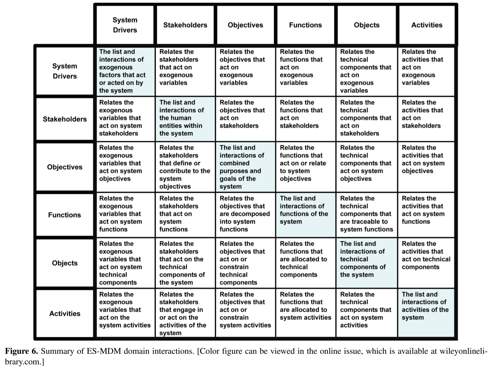

"C:\repos\capstone_isd\references\delaurentis-2005-understanding-transportation-as-a-system-of-systems-design-problem.pdf"

"C:\repos\capstone_isd\evidence\sources\Irregular airline operations a review of the state-of-the-practice in airline operations control centers.pdf"

When talking about modeling, we generally think about things like Class Diagrams, Collaboration Diagrams, State Diagrams, and so on. UML (Unified Modeling Language) defines a (the) standard notation for these kinds of diagrams. Using a combination of UML diagrams, a complete model of an application can be specified. This model may be used purely for documentation or, given appropriate tools, it can be used as the input from which to generate part of or, in simple cases, all of an application.

From <https://www.ibm.com/docs/en/wdfrhcw/1.4.0?topic=guides-emf-framework-programmers-guide> 

Need to acknowledge & speak to OMG (Object Management Group) MOF (Meta Object Facility)
https://www.omg.org/mof/

The MetaObject Facility Specification™ (MOF™)is the foundation of OMG's industry-standard environment where models can be exported from one application, imported into another, transported across a network, stored in a repository and then retrieved, rendered into different formats (including XMI™, OMG's XML-based standard format for model transmission and storage), transformed, and used to generate application code. These functions are not restricted to structural models, or even to models defined in UML - behavioral models and data models also participate in this environment, and non-UML modeling languages can partake also, as long as they are MOF-based

OMG® is a not-for-profit, open-membership computer industry specifications consortium; our members define and maintain the MOF specification which we publish in the documents linked on this page for your free download. Software providers of every kind build modeling tools that manipulate models in MOF-compliant format - export, import, store, transform, generate code, and so on. OMG doesn't provide any of the software - we provide only the specifications that make software products interoperate. 

OMG members voted to establish the MDA (Model Driven Architecture) as the base architecture for our organization's standards in late 2001. Software development in the MDA starts with a Platform-Independent Model (PIM) of an application's business functionality and behavior, constructed using a modeling language based on OMG's MetaObject Facility™ (MOF™). This model remains stable as technology evolves, extending and thereby maximizing software ROI. MDA development tools, available now from many vendors, convert the PIM first to a Platform-Specific Model (PSM) and then to a working implementation on virtually any middleware platform: Web Services, XML/SOAP, EJB, C#/.Net, OMG's own CORBA®, or others. Portability and interoperability are built into the architecture. OMG's industry-standard modeling specifications support the MDA: The MOF; Unified Modeling Language™ (UML®), now at Version 2.0; the Common Warehouse Metamodel™ (CWM™); and XML Metadata Interchange™ (XMI®).

GOPPRRE
Graph
Object
Point
Property
Relationship
Role
Extension (e.g. constraints)

Graph is an entity collection of Object, Relationship, and Role, represented in one layout (e.g., a UML class diagram). The graph is either a visual diagram or another that was decomposed (explored) by one Object.
• Object is an entity that constructs a Graph. • Point is one attached port in an Object.
• Relationship refers to one connection between the Points
and/or Objects.
• Role is used to define the binding restrictions with the relevant Relationship. One Relationship is associated with two Roles. Through each role, the Relationship is defined as one that binds with one Point or one Object in its one end.
• Property is a specific attribute of meta-models that is
attached to the other five meta-meta models.
• Extension refers to the additional constraints used to construct meta-models. In this paper, one constraint is developed as a connector. It refers to one binding between one Point or Object and one Role in one side of the Relationship.

I need a language, a method, and a tool. I think SysML is that, using GOPPRRE, and Cameo MagicDraw. Idk how DODAF 2.0 changes that or why? 

How does OOSEM relate to these concepts: 
What is OOSEM?
• Definition: A top-down, scenario-driven method combining object-oriented concepts with traditional systems engineering.
• Management: Maintained by the INCOSE Object-Oriented SE Method Working Group to support standard processes like ISO 15288.
• Language Integration: Captures system artifacts via SysML diagrams (such as use case, requirement, and structure diagrams). [1, 2, 3, 4]
Key Activities in the OOSEM Process
• Analyze Requirements: Define stakeholder needs and operational scenarios.
• Define Logical Architecture: Model system behavior and logical components without hardware constraints.
• Synthesize Physical Architecture: Allocate logical functions to physical hardware, software, and people.
• Verify and Validate: Ensure the design meets requirements using analysis and models.

I'd kind of like to produce a massive version of this, where each of the rows/columns consist of many sub-rows/columns: 

The FAA defines or governs things such as airspace structure, operating rules, certification requirements, separation standards, procedure design criteria, and system-level safety/capacity policy. Those strongly shape the feasible trajectory space, but the FAA institution generally does not decide whether Flight 123 climbs now, takes a reroute, slows 15 kt, or absorbs three minutes of delay. Those decisions occur farther down the authority chain through controllers/traffic management, operators/dispatchers, flight crews, and ultimately aircraft/FMS functions.