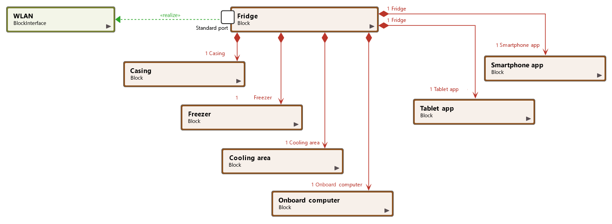

## The Block Diagram. Structure of the System.

What do block diagrams show, why are they important and what properties and elements do they have?

[This is a very helpful website, whose content is mostly copied below. Acquired without their permission.](
https://www.microtool.de/en/knowledge-base/what-is-a-block-diagram/)

## What Is a Block Diagram?

A block diagram is a graphical representation of a system – it provides a functional view of a system. Block diagrams give us a better understanding of a system’s functions and help create interconnections within it. Block diagrams derive their name from the rectangular elements found in this type of diagram. They are used to describe hardware and software systems as well as to represent processes. Block diagrams are described and defined according to their function and structure as well as their relationship with other blocks.

## What Is a Block?

Blocks or system building blocks are modular structures within SysML (Systems Modeling Language) that represent statistical concepts and objects in the system. In the world of software development, for example, blocks describe data elements and operators or control flow elements. A block in a block diagram describes many identifiable properties that, taken together, define the block in question. Blocks describe a system as a collection of parts that play a particular role in a specific context.

## Why Are Block Diagrams Important?

A block diagram is an essential method used to develop and describe hardware or software systems as well as represent their workflows and processes. Block diagrams are used in electronics to represent systems and their shifting e.g. mechatronic systems in the trucking industry.

Block diagrams are generally used when the visualization of information or control flows is important – or when processes are involved. In this way we can represent complex algorithms or flows of information or communication among individual components within a large system as with, for example, in a facility designed for mass production. A graphical representation is often easier to understand than a textual representation.

## A Block Diagram allows us to make detailed descriptions of systems,  
their interfaces and other aspects of the system structure.

## Blocks and Their Properties

Block diagrams describe different hierarchies and connections between individual building blocks within a system. These elements are represented as blocks. Dependent relationships among properties, their values, their constellations and their behavior are described. Block diagrams are suited particularly well to providing simplified representations of functional processes and of relationships between individual building blocks in a system. The way in which properties and parts of the blocks are integrated can be described in another kind of diagram – the internal block diagram.

## Internal Block Diagrams

In _internal Block Diagrams_ the structure and flows within system blocks are described using OMG SysML™ (_Systems Modeling Language_). These diagrams give us a simple overview of how parts of blocks relate to each other and what kind of data, information, signals or material flow between elements, and in which direction.

## Blocks and Their Properties

Block diagrams describe different hierarchies and connections between individual building blocks within a system. These elements are represented as blocks. Dependent relationships among properties, their values, their constellations and their behavior are described. Block diagrams are suited particularly well to providing simplified representations of functional processes and of relationships between individual building blocks in a system. The way in which properties and parts of the blocks are integrated can be described in another kind of diagram – the internal block diagram.

## Internal Block Diagrams

In _internal Block Diagrams_ the structure and flows within system blocks are described using OMG SysML™ (_Systems Modeling Language_). These diagrams give us a simple overview of how parts of blocks relate to each other and what kind of data, information, signals or material flow between elements, and in which direction.

## Elements in Block Diagrams

**Block** logical and physical system components

**Part** all aspects modelled using aggregation and association

**Referenz** all parts that have been modelled using aggregation and association

**Standard-Port** Point of interaction between a system block and its environment

**Flow-Port** Point of interaction through which or out of which a block could emerge

## Relationships within Block Diagrams

The **association** describes the communication among blocks.

An **aggregation** how a whole is comprised of parts.

A **composition** is a strict form of aggregation in which the existence of an object that is part of the whole is dependent on the existence of the whole.

a **generalization** is a directed relationship between blocks in which a special block has all the properties of the general block.

**Block Diagram in a tool**

Defining the structure of your system is the first step in developing new software. But this structure must be made available to all those who are developing the software. The way in which teams continue to work on the results will determine whether the efforts put into the structure will bear fruit or not. The best thing to do would be to use a tool that can be used by your whole team and which provides everyone concerned with analyses and deliberations in real time.