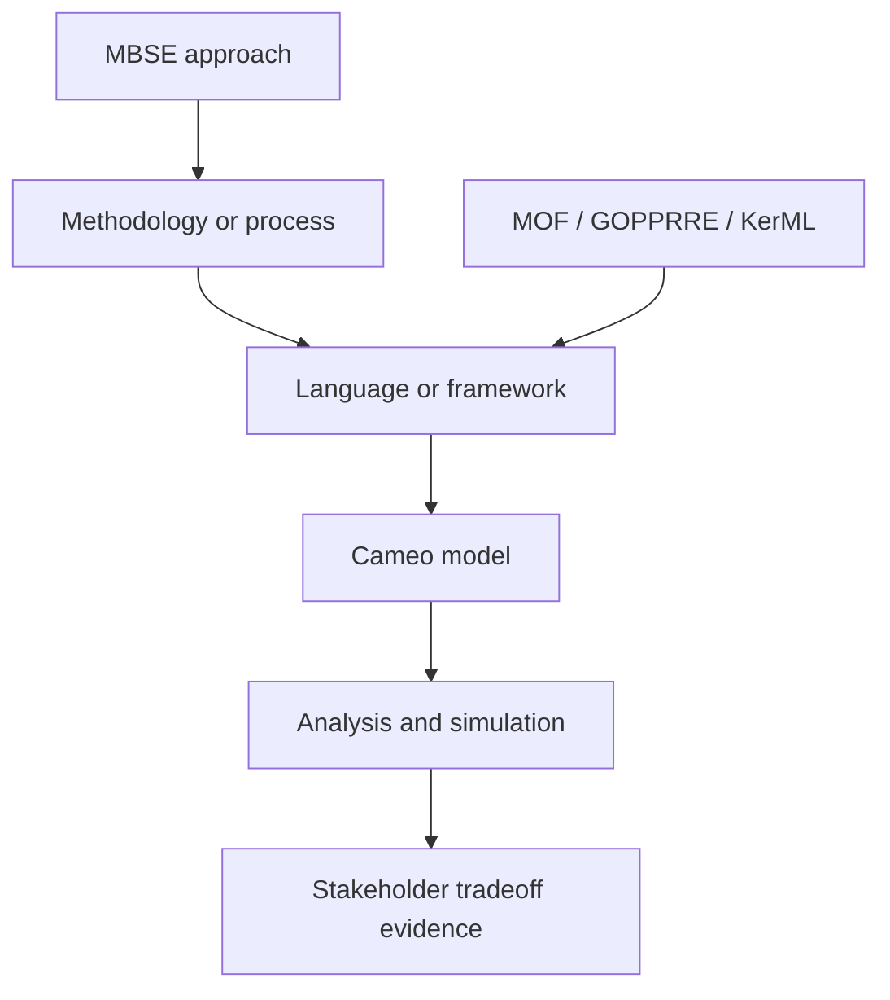
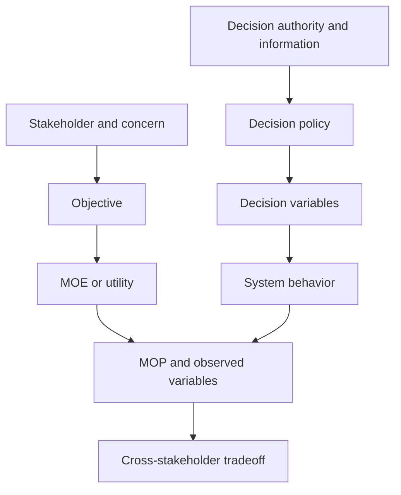

# Journal — 2026-09-06

## 03:00PM — ChatGPT Clarifying Conversation

I oposed a question to ChatGPT: 

I"m working the start to my capstone project. I'm investigating how I should model the system of systems I'm investigating, which will focus on tradeoffs between different MOPs for different stakeholders when decisions are made with limited consideration of others (e.g. myopic optimizations of one aircraft or one phase only). I'm learning about MBSE more generally, or some component of its history and evolution, as I'm reading about GOPPRRE & KARMA in the context of UML & SysML and its difficult to extract clear boundaries between them all. I've been thinking of using Cameo MagicDraw, which gives me the opportunity to select a MBSE method (I believe) through a UML, SysML, or DODAF 2.0 approach. Per my understanding, UML is the general MBSE architecture and conceptual definition, SysML is an extension of that or a refined definition more capable for the needs of systems engineering in an environment/product where certification is important, and DODAF is similar, but focused on how the US Military typically views, describes, and anlyzes things? Help me understand the different concpetual aspects simultaneously being considered and help me work through a decision framework for what I should use and apply on my project, especially if I choose to use MagicDraw as my MBSE tool.

It answered with: 

Your understanding is directionally right, but several different “layers” are being treated as though they are competing alternatives. The most important correction is:

> UML, SysML, DoDAF, GOPPRRE, KARMA, Cameo, and an MBSE methodology do not all occupy the same conceptual level.

For your capstone, I would use a SysML-centered model in Cameo, adopt a deliberately small modeling method tailored to stakeholder tradeoffs, and borrow selected enterprise-architecture concepts from UAF/DoDAF without making the whole project DoDAF-compliant.

## 1. Untangling the concepts

| Concept             | What it is                                                                             | What it determines                                                                               | Relevance to your project                                                                         |
| ------------------- | -------------------------------------------------------------------------------------- | ------------------------------------------------------------------------------------------------ | ------------------------------------------------------------------------------------------------- |
| MBSE                | An engineering approach                                                                | Models are primary engineering artifacts, not illustrations added after analysis                 | The overall way you conduct the capstone                                                          |
| Methodology/process | Instructions for building and using the model                                          | What you model first, how artifacts relate, and how completeness is assessed                     | You need to define or adopt one                                                                   |
| UML                 | A general-purpose modeling language developed primarily for software-intensive systems | Available model elements, relationships, and diagram notation                                    | Useful foundation, but not the best primary language                                              |
| SysML               | A general-purpose systems modeling language                                            | Requirements, structure, behavior, interfaces, quantities, constraints, verification             | Best primary language for your capstone                                                           |
| DoDAF               | An enterprise-architecture framework for DoD decision needs                            | Required viewpoints, architecture data, and presentations                                        | Useful source of operational/capability viewpoints; probably excessive as the governing framework |
| UAF                 | A standardized enterprise/SoS architecture framework and language profile              | Capabilities, operations, resources, services, projects, personnel, motivation, and traceability | Conceptually more relevant than DoDAF if enterprise-scale modeling becomes central                |
| GOPPRRE             | A meta-metamodeling formalism                                                          | Primitive concepts used to define or integrate modeling languages                                | Important for language integration research, not necessary for your working model                 |
| KARMA               | A semantic, multi-architecture modeling language based on GOPPRRE                      | Representation and integration of models from multiple formalisms                                | Potential research alternative, but not a natural addition to Cameo                               |
| Cameo/MagicDraw     | A modeling-tool family                                                                 | Editing, model storage, validation, queries, tables, simulation, document generation             | Your implementation environment                                                                   |
| MagicGrid           | A Cameo-oriented MBSE methodology                                                      | A sequence connecting problem, solution, requirements, behavior, structure, and verification     | A useful starting method, but it needs adaptation for your SoS question                           |

The shorthand distinction is:

* A **language** tells you what statements you are allowed to make.
* A **framework** tells you which descriptions decision-makers need.
* A **methodology** tells you how to develop those descriptions.
* A **metamodel** defines the concepts and legal relationships in a language.
* A **tool** stores, edits, checks, queries, and displays the resulting model.
* An **analysis model** calculates consequences; the architecture model does not automatically do that merely because it is in SysML.

## 2. Correcting the UML → SysML → DoDAF interpretation

### UML

UML is not the general architecture of MBSE. It is a standardized language originally oriented toward specifying, visualizing, and documenting software systems. It supplies concepts such as classes, objects, activities, states, components, interactions, and use cases. [OMG describes UML primarily in terms of software-system artifacts](https://www.omg.org/spec/UML/2.5.1/About-UML).

UML can model many non-software subjects, but concepts important to systems engineers—requirements, physical quantities, continuous constraints, allocations, and system composition—are not its central strength.

### SysML

SysML v1 was constructed as a profile and extension of UML. It reused parts of UML, added systems-engineering concepts, and omitted some software-specific material.

Your “refined for certification” interpretation needs adjustment. SysML is not intrinsically a certification language. It is useful in regulated development because it can support:

* explicit requirements;
* traceability;
* verification relationships;
* interface definitions;
* allocation;
* configuration control;
* model validation.

Whether that evidence satisfies certification depends on the applicable development-assurance regime and modeling practices—not on the use of SysML itself.

There is also now an important historical break: [SysML 2.0 became an OMG specification in September 2025](https://www.omg.org/spec/SysML/2.0/About-SysML). Unlike SysML v1, SysML v2 is not merely a UML profile; it is founded on KerML and has a more rigorous semantic and textual basis. Consequently, when discussing “SysML” in your paper, identify whether you mean SysML v1.x or v2.

For a one-semester Cameo project, mature SysML v1 support may still be the pragmatic choice, depending on your installed Cameo/CATIA Magic release and university license. Do not let migration to a new language generation become the capstone.

### DoDAF

DoDAF is not a military version of SysML. It is an architecture framework designed to support particular DoD decision processes. It specifies architecture data and stakeholder-oriented viewpoints such as:

* Capability;
* Operational;
* Systems;
* Services;
* Data and Information;
* Standards;
* Projects;
* All Viewpoint.

The official guidance says DoDAF represents enterprise architecture in ways that let stakeholders focus on particular interests while retaining the larger context. Its underlying organizing model is the DoDAF Meta-model, DM2. [DoDAF viewpoints](https://dodcio.defense.gov/Library/DOD-Architecture-Framework/dodaf20_viewpoints/) and [DM2](https://dodcio.defense.gov/Library/DoD-Architecture-Framework/dodaf20_dm2/) are therefore different in nature from SysML diagrams.

DoDAF asks questions such as:

* What capability must exist?
* Which operational activities realize it?
* Which performers conduct those activities?
* What information or resources flow between them?
* Which systems or services support them?
* How does the architecture evolve over time?

Those are highly relevant questions for the NAS, but adopting DoDAF also brings vocabulary and artifacts oriented toward DoD acquisition and decision processes. Unless DoD compliance is part of your research question, full compliance would likely create work without improving your central argument.

### UAF

UAF is worth recognizing because it generalizes many DoDAF/MODAF/NAF ideas and is explicitly suited to enterprise and system-of-systems architecture. Cameo Enterprise Architecture supports DoDAF through its UAF-oriented tooling. Dassault describes Cameo Enterprise Architecture as supporting DoDAF, MODAF, NAF, and UAF through a standards-based solution. [Cameo Enterprise Architecture](https://www.3ds.com/products/catia/no-magic/cameo-enterprise-architecture)

For your subject, UAF is arguably a better conceptual fit than DoDAF because you are studying:

* capabilities;
* organizations and stakeholders;
* operational activities;
* resources and systems;
* decision authority;
* multi-level effects;
* system-of-systems evolution.

But UAF is broad. It could easily cause you to spend the semester learning and populating the framework rather than answering the optimization question.

## 3. Where GOPPRRE and KARMA fit

GOPPRRE operates below the level at which you will ordinarily construct your capstone model. It uses general primitives such as:

* Graph;
* Object;
* Point;
* Property;
* Role;
* Relationship;
* Extension.

These primitives can describe the structure of multiple modeling languages, enabling transformations, ontology generation, and integration across heterogeneous formalisms.

KARMA is a semantic architecture modeling language built using that foundation. The research motivation is not simply “better SysML.” It is closer to:

> How can models created using different architecture formalisms be expressed, connected, queried, transformed, and reasoned over through a common semantic foundation?

The published literature describes GOPPRRE as a meta-metamodeling approach and KARMA as its associated multi-architecture semantic language. [Design Ontology Supporting MBSE](https://arxiv.org/html/2010.07627v1), [semantic ontology approach](https://www.frontiersin.org/journals/manufacturing-technology/articles/10.3389/fmtec.2022.886518/full)

That is interesting background for your literature review, particularly if you discuss the historical progression from diagram-based models toward semantic, machine-queryable engineering knowledge. But I would not choose KARMA for this capstone unless your research contribution is specifically model interoperability or ontology-based reasoning.

A useful abstraction hierarchy is:

The bottom box supplies foundations for languages; it is not normally where the practicing modeler starts.

## 4. The actual decision you need to make

You do not need to answer “Which one of UML, SysML, or DoDAF will I use?” as a single exclusive choice. Instead, make several separate decisions.

| Decision                  | Recommended choice                                                                                 |
| ------------------------- | -------------------------------------------------------------------------------------------------- |
| Primary modeling language | SysML                                                                                              |
| Architecture scope        | Enterprise/SoS context with one representative decision thread                                     |
| Method                    | A lightweight project-specific method, informed by MagicGrid                                       |
| Enterprise concepts       | Selectively borrow capability, operational, resource, and information-flow concepts from UAF/DoDAF |
| Quantitative analysis     | External Python/MATLAB optimization or simulation connected to model parameters                    |
| Tool                      | Cameo Systems Modeler/CATIA Magic Cyber Systems Engineer                                           |
| Custom semantics          | Small profile for decisions, stakeholder measures, scope, information, and optimization policies   |
| GOPPRRE/KARMA             | Literature context unless interoperability becomes a research objective                            |
| Full DoDAF compliance     | No, unless required by sponsor or evaluator                                                        |
| SysML version             | Use the version reliably supported by your installed tool and instructional environment            |

## 5. A decision framework

Score each candidate against what your capstone must accomplish.

| Criterion                                    |        UML |      SysML |                            DoDAF/UAF |                       KARMA/GOPPRRE |
| -------------------------------------------- | ---------: | ---------: | -----------------------------------: | ----------------------------------: |
| Physical and cyberphysical system structure  |     Medium |       High |                          Medium–High |                    Potentially high |
| Requirements traceability                    | Low–Medium |       High |                               Medium |           Depends on implementation |
| Quantitative parameters and constraints      |        Low |       High |                           Low–Medium |                    Potentially high |
| Stakeholder/organization representation      | Low–Medium |     Medium |                                 High |                                High |
| Operational and capability views             |     Medium |     Medium |                                 High |                                High |
| Direct Cameo maturity                        |       High |       High | High with appropriate product/plugin |                                 Low |
| Ease of communicating to SE audience         |     Medium |       High |                               Medium |                                 Low |
| Learning burden for one semester             |     Medium |     Medium |                                 High |                           Very high |
| Support for your optimization experiments    |        Low |       High |                             Indirect | Requires substantial infrastructure |
| Risk of framework work overwhelming research |        Low | Low–Medium |                                 High |                           Very high |

This points toward **SysML plus a few UAF/DoDAF concepts**, not a pure DoDAF or KARMA implementation.

## 6. Your project needs a decision-centric metamodel

The most important modeling choice is not the diagram family. It is the semantic chain connecting stakeholder value to local decisions and system-wide outcomes.

I recommend this central chain:

This makes your scientific argument queryable:

1. A stakeholder has concerns and objectives.
2. Those objectives are evaluated through measures of effectiveness or utility.
3. System and operational behavior produces measurable performance.
4. A decision-maker controls only certain variables.
5. The decision-maker sees only certain information.
6. Its policy optimizes an objective over a particular scope and horizon.
7. The resulting behavior affects its own measures and other stakeholders’ measures.
8. Alternative scopes or coordination policies generate different tradeoffs.

That is the heart of the capstone. Everything else should support it.

### Be precise about MOP versus MOE

You may eventually find that “tradeoffs among stakeholders’ MOPs” does not fully capture what you mean.

* **MOP:** How well does the system or process perform?
  Examples: fuel burned, flight time, path deviation, queue delay, throughput, separation margin.

* **MOE:** How well does the outcome satisfy a stakeholder’s objective in the operational context?
  Examples: airline operating value, passenger arrival reliability, controller workload acceptability, network efficiency, climate impact.

* **Utility/value function:** How does a stakeholder combine several measures and preferences?
  Example: airline utility combining fuel, crew time, maintenance exposure, delay, and passenger disruption.

The same MOP can contribute differently to multiple stakeholders’ MOEs. That crosswalk is exactly where your project becomes interesting.

## 7. Representing “myopia” explicitly

Do not model myopia only as a narrative description such as “the aircraft minimizes its own fuel.” Give every decision policy attributes such as:

| Attribute               | Example                                                |
| ----------------------- | ------------------------------------------------------ |
| Decision-maker          | Aircraft FMS                                           |
| Authority               | Speed and lateral path within clearance                |
| Decision variables      | Mach, altitude request, route offset                   |
| Objective function      | Minimize predicted trip cost                           |
| Included measures       | Fuel and arrival time                                  |
| Excluded effects        | Downstream sequencing and contrail impact              |
| Information available   | Aircraft state, winds, active route                    |
| Information unavailable | Other aircraft intent, airport congestion              |
| Spatial scope           | One trajectory                                         |
| Temporal horizon        | Remaining flight                                       |
| Operational phase       | Cruise only                                            |
| Constraints recognized  | Aircraft limits and current clearance                  |
| Coordination mechanism  | Altitude request to ATC                                |
| Affected stakeholders   | Airline, passengers, ANSP, nearby flights, environment |

You can then define myopia as a difference between:

* the effects a decision creates;
* the effects represented in the decision-maker’s objective;
* the effects observable to the decision-maker;
* the effects the decision-maker has authority to control.

That is a much stronger formulation than merely contrasting “local” and “global” optimization.

## 8. Recommended Cameo model organization

I would organize the repository by modeling purpose rather than by diagram type:

1. **Model governance**

   * scope, assumptions, terminology, modeling conventions;
   * viewpoints and stakeholder concerns;
   * element ownership and naming rules.

2. **System-of-interest and environment**

   * NAS/air-transportation context;
   * constituent systems;
   * authority, ownership, and lifecycle boundaries.

3. **Stakeholders and value**

   * stakeholder taxonomy;
   * concerns and objectives;
   * MOP/MOE definitions;
   * utility or cost-function definitions.

4. **Operational scenarios**

   * nominal flight lifecycle;
   * selected optimization scenario;
   * interactions among airline, flight crew, FMS, ATC, and infrastructure.

5. **Functions and behavior**

   * activity diagrams;
   * state machines where phase or mode matters;
   * sequence diagrams for decision and information timing.

6. **Logical and physical architecture**

   * blocks, parts, interfaces, ports, and flows;
   * allocations of activities to performers and systems.

7. **Decision architecture**

   * decision-makers;
   * authority;
   * information sets;
   * decision variables;
   * constraints, objectives, horizons, and policies.

8. **Trade-study instances**

   * baseline;
   * aircraft-only optimization;
   * phase-limited optimization;
   * airline-aware optimization;
   * coordinated/network-aware optimization.

9. **Analysis and evidence**

   * parametric relationships;
   * analysis-tool interfaces;
   * simulation outputs;
   * verification cases and conclusions.

Cameo tables and matrices may prove more valuable than polished diagrams. In particular, create matrices for:

* stakeholder × concern;
* objective × measure;
* decision policy × included measure;
* decision policy × available information;
* system behavior × affected stakeholder;
* requirement × behavior × architecture element;
* scenario × resulting MOP/MOE.

## 9. Keep the custom profile small

If Cameo permits it, introduce a limited profile with stereotypes such as:

* `StakeholderObjective`
* `MeasureOfPerformance`
* `MeasureOfEffectiveness`
* `DecisionAuthority`
* `DecisionPolicy`
* `DecisionVariable`
* `InformationSet`
* `OptimizationHorizon`
* `AffectedStakeholder`
* `ExternalAnalysis`
* `ModelAssumption`

Do not build an entire new language. Apply stereotypes to standard SysML elements and add only the properties necessary to make your research questions queryable.

For example, `DecisionPolicy` could extend a SysML activity or block and possess:

* optimizing stakeholder;
* objective expression;
* included measures;
* excluded known effects;
* decision horizon;
* controlled variables;
* observed information;
* authority constraints;
* associated scenario;
* analysis implementation.

## 10. A workable modeling method for the capstone

For each representative optimization case:

1. Define the stakeholder concern and desired outcome.
2. Define the constituent systems and operational boundary.
3. Define authority: who may decide what.
4. Define the operational behavior before optimization.
5. Identify exchanged information and its timing.
6. Define affected MOPs and stakeholder MOEs.
7. Define the local optimizer’s information, variables, constraints, scope, and objective.
8. Connect the architecture model to the quantitative analysis.
9. Execute local and broader-scope alternatives.
10. propagate outcomes to every affected stakeholder measure.
11. Compare Pareto tradeoffs and unintended consequences.
12. Identify architectural changes that could reduce the loss from myopia.

That last step is critical. Your project becomes more than “global optimization is better” if it asks:

> What information exchange, decision authority, coordination mechanism, or objective alignment would enable a locally controlled system to produce better SoS outcomes?

## Bottom line

I would state your capstone approach approximately as follows:

> The project will employ SysML in Cameo as its primary systems-modeling language. A decision-centric modeling method, informed by MagicGrid and selected UAF/DoDAF concepts, will represent stakeholder concerns, operational activities, constituent systems, decision authority, information availability, and quantitative performance relationships. External optimization analyses will evaluate how changes in decision scope, information, objective functions, and planning horizon propagate across stakeholder-specific measures of performance and effectiveness.

This is rigorous, achievable, recognizable to an MBSE audience, and directly aligned with your actual research question. Full DoDAF would be justified only if producing a DoD-conformant architecture is itself an outcome; KARMA/GOPPRRE would be justified only if semantic integration among heterogeneous modeling languages is part of the research contribution.

## 15:41 — Tag-Up

*PM check-in (`persona-pm`), user-requested, against `to-do-list.md`'s ECD tags as of
2026-09-06. PM voice only — not the full `session-tagup.md` ritual, so no Professor pass
this time.*

**Bottom line: the Sept 7 milestone cluster is not going to land clean.** Half of it is
effectively done and just needs checkboxes updated; the other half (two SysML diagrams)
has zero artifact progress because no Cameo/SysML modeling has started at all yet.

**At risk / slipping tomorrow — ECD 2026-09-07 ("PESTLE Analysis & System Definition"):**

- NAS context diagram (§10) — at risk → slipping. No `cameo_models/` directory exists
  yet; zero SysML modeling work has started anywhere in the project.
- Stakeholder model / "stakeholder map" (§10) — at risk → slipping. Same root cause — the
  data exists but not as a SysML artifact, which is the actual deliverable.
- Initial SOI pass (§1) — at risk. `open-questions.md` still lists all 5 boundary
  questions unresolved; `index.md`'s 9 candidate domains are an explicitly unratified
  working draft.
- Finalize research questions (§1) — borderline. The 6 questions are already drafted as
  the checklist text itself; likely just needs a deliberate confirm-and-check.

**Quietly ahead of the checkboxes, same ECD:** PESTLE stakeholder discovery + stakeholder
register (§7) — `knowledge/models/stakeholder-register.md` already has a full 6-category
PESTLE table (~50 stakeholders) and an enterprise-objective hierarchy with flow-down
examples. To-do-list checkboxes are unchecked but the deliverable substantially exists —
recommend checking these off; the still-open work (needs/authorities/resources per
stakeholder, RACCI) belongs to the next ECD, not this one.

**Next cluster — ECD 2026-09-10 ("Authority & Responsibility Models"):** RACCI matrix,
responsibility swimlanes, authority/responsibility transitions (§7/§10) — at risk, not
started, and the swimlanes need the same not-yet-stood-up Cameo model. 4 days out.

**On track (real, but only because there's still runway):** §2-§4 literature review (ECD
2026-11-17) — source register fully triaged/rated (32/32), 3 sources deeply annotated,
but none of the *named* to-do-list papers (Eltoukhy, Clarke, dispatcher research, etc.)
have their own "read and annotate" checklists started; ~10 weeks of runway. §8, §11-§13,
§15, §16 — future-dated, nothing started, no immediate concern. §6 and §9 remain
unscheduled (no ECD in the submittal) — flagged per standing instruction.

**Loose end:** §1's "Establish project milestone timeline" is marked done (2026-08-29)
but "Identify milestone checkpoints for interim review(s)" is still unchecked.

**Recommended action:** Accept the Sept 7 diagram slip explicitly rather than let it pass
silently — stand up `projects/nas-sos-capstone/cameo_models/` this week as the top
priority (nothing downstream is reachable until modeling starts), check off the
PESTLE/stakeholder-register boxes that are genuinely done, and push the two diagram
deliverables to a firm date inside the Sept 10-22 window. Worth running past the advisor
too, given the submittal's own literature-review-after-architecture sequencing tension
noted at the top of `to-do-list.md`. **Not yet acted on** — `task-board.md` unchanged
pending the user's decision on this recommendation.
