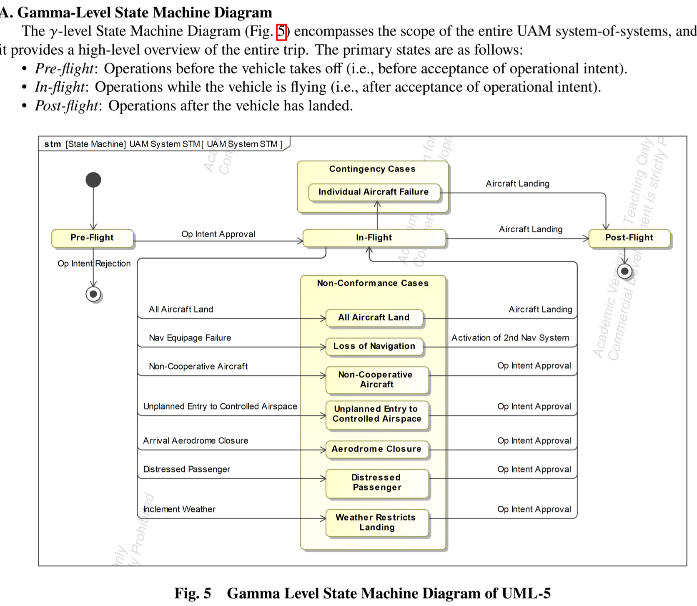

# Journal — 2026-09-13

## 12:12 — Idea

Naming a problem set I want this capstone to at least partially address, not just
produce an architecture in spite of:

1. Existing MBSE tools poorly communicate cross-view relationships.
2. Multi-view consistency is difficult to understand.
3. Large SoS architectures become cognitively fragmented.
4. Traceability is difficult to intuit.

These aren't abstract — they're the exact failure mode the project's own deliverable
chain is exposed to. §10's traceability requirements (needs → objectives → requirements
→ systems → activities → information exchanges) and §13 (simulation → SysML blocks →
stakeholder goals → aircraft behavior) are multiple long trace chains across many
view types (BDD, IBD, state machine, sequence, activity, requirements model) in one
Cameo model. If those chains are hard for *me* to hold in my head while building them,
that's evidence for problems 1-4, not just a personal navigation complaint.

Don't yet know whether to address this as: a modeling *discipline* (naming/structuring
conventions that keep traces legible without tooling help), a lightweight tooling/viz
layer on top of the Cameo export (something that renders cross-view trace paths, e.g.
from the `nas_system_of_systems_architecture.xml` export), or just an explicit
"known limitation" to name in the final paper rather than solve. Revisit once §10/§13
traceability work is far enough along to know which failure mode actually bites.

I could publish multiple outputs: 
 - Optimization tradeoffs & 
 - Geometric Representation of Multi-View System Architectures for Model-Based  System-of-Systems Engineering

 ## ConOps Work
 Took some handwritten notes, which I then narrated to ChatGPT for use in formalizing, recording actions/unknowns, and facilitating further research: 

 Today 10:23 AM

I'm working on the CONOPS for my capstone, and I want to narrate to you kind of some thoughts and some specific perspectives and have you record them in a meaningful way

Yeah, absolutely. Go ahead and, and narrate. I'll capture the threads and I'll hand you back a clean structure once you're done. Start wherever feels natural, and I'll follow your lead.

Alright, so uh just some uh preliminary thoughts, market segmentation through city pair and fleet assignment and the service model whether that's luxury versus low cost or hub and spoke versus point to point is going to be something that I'm assuming is out of scope I'm going to need to come up with a rationale that I can give for that, and, and somehow speak to that

Right. Yeah. I'd say a good rationale could be that CONOPS assumes a given service model and treats network design as a constraint. So, that way you're not optimizing market segmentation. You're inheriting it. And then focusing on how operations execute within that context. Is that close to what you're thinking?

Absolutely. I'm going to start simple and give some perspectives probably from the eyes of the pilot. I need to consider if I want to do it from the eyes of the dispatcher in the future, and the eyes of the passengers, or from the eyes of every stakeholder But next up I'll start narrating from the perspective of the pilot

Right. Sounds good. Go for it.

Okay um so I need to think through uh kind of the the very first stages. At some point there's a schedule that's published with flights. So after the market segmentation and the network design and all of that the airline knows that they've got a set number of crew who are trained for different aircraft types, and there are different aircraft types assigned to different routes, and at some point they say this is the way we're going to assign our crew to specific aircraft and specific flight legs on specific days. Oftentimes with like multiple connections from say Grand Rapids to Detroit, Detroit to Tampa, Tampa to DC, DC to Philly, Philly to Detroit and so on

Hmm. Right. Yeah.

So I need to think through kind of what that schedule publication is

Right. So you're starting effectively post-network design, where the published schedule is a given, and the pilot enters once pairings are built around fleet, qualifications, and duty rules. I'm tracking that.

Beautiful. So kind of from the perspective of the pilot literally the eyes, I wake up, I know I need to commute. I've got some type of digital system I probably log into whether that's ForeFlight or otherwise. I can check my schedule, make sure everything's the same as it was yesterday, and as was previously published. I can see my specific aircraft that's assigned to me, probably by tail number, probably history of performance, probably old statistics on it. Um, I can see my time of departure. I can also probably get best practices for my route, like single engine taxi out optimal takeoff flaps, compare myself to other pilots, you know, what are they doing and how are they doing it in this specific airport on this route and try to think through things like fuel requirements or otherwise

Hmm. Got it. I'm tagging a few important uncertainties there for later. When approach assignments really firm up, where controller boundaries lie in practice, how approach minima and landing specifics are defined, and the exact ground control sequence, plus the gate interfaces. And the question of when a flight operationally ends is a good one. We should probably keep that distinction. Sounds like a full nominal thread from your side.

Beautiful. Show me my notes

Sure, one sec. All right, here's a clean write up. So your CONOPS nominal thread. Purpose: you want to map a nominal airline flight from the pilot's lens while tagging decision authorities and research gaps. The scope boundary is post-network design. The schedule and fleet strategy are treated as constraints. Then the pilot's day begins. So, they check the schedule in airline systems, confirms assignments, gets the dispatch release, sets up the FMS, coordinates with the cabin and ground, manages the pushback, taxies out, takes off, climbs, cruises with monitoring and possible step climbs, sets up the descent, flies the approach, lands, taxis in, and turns the aircraft around. And be congratulated by the passengers. For each phase, we should capture actors, information flows, decision authorities, constraints, and optimization objectives, plus any open research questions. If you'd like, next time we can turn this into a structured CONOPS outline.

Turn this into a structured conopsnoutline for a nominal flight

Below is a structured **nominal commercial-flight CONOPS outline** built from your narration. I’ve intentionally preserved uncertain points as **research questions** rather than silently correcting them, because resolving those questions is part of the value of developing the CONOPS.

<CONTENT MOVED TO CONOPS Section>

# Source Reviews
From [Mudumba UAM Paper]("C:\repos\capstone_isd\evidence\sources\mudumba-et-al-2022-model-based-systems-engineering-approach-for-simulating-uml-5-uam-operations.pdf")

## Reference processing sweeps

Ran `/process-references` twice today, closing a gap where 18 files had been sitting in
`evidence/sources/` since the PKM reorg without ever getting a bib entry, summary, or
ledger row.

**Sweep 1 (18 files):** processed the backlog — mostly SysML/MBSE methodology papers
(UAV/flight-control/ATC case studies), three GreAT (EU-China H2020 ATM project)
deliverables, SESAR Master Plan 2025 + its eATM capability spreadsheet, and the two
papers the user had just added (McDermott AI4SE/SE4AI roadmap; DeLaurentis's
airports-under-distributed-air-transportation SoS paper). Standouts: the GreAT D2.2
operational+system architecture deliverable (5/5) is a rare real precedent for deriving
ATM architecture from an operational concept via MBSE — directly useful for to-do §6/§10,
not yet started. Register went from 32/32 this morning to 50/50.

One thing worth remembering: the subagent that ran this sweep also quietly rewrote three
unrelated pre-existing PDFs (metadata re-serialization, harmless but out of scope) and
recompiled `main.pdf` — caught it via `git status`/`git diff --stat` after the fact and
reverted those four files. Worth a tighter scope note next time a subagent gets broad
Bash access for PDF-reading work.

**Sweep 2 (2 files):** the user added two more — António Castro's 2013 FEUP PhD thesis
(originates MASDIMA, a distributed multi-agent-system approach to AOC disruption
management, with explicit per-stakeholder aircraft/crew/passenger utility functions) and
Bouarfa, Müller & Blom's 2018 *JATM* paper benchmarking that same MASDIMA policy against
human-team AOC coordination. Rated the thesis 5/5 — it's a real implemented
decomposition with per-stakeholder objective functions, directly relevant to both the
architecture work (§6/§10) and the objective/cost-ontology and myopic-optimization
analysis (§7-9). Only skimmed the front matter so far; flagged as a priority for a full
`annotate-source.md` deep-read pass. Register now at 54/54 processed.

## 13:30 — Tag-Up (EPM check-in)

Ran the Engineering Project Manager persona against `to-do-list.md` ECDs vs. today
(2026-09-13). Verdict: **at risk** — three ECD-dated items are already past due with no
progress, though the two sections that *have* moved are ahead of schedule.

**Slipped (past ECD, not started):**
- §1 Establish Research Framework — ECD 2026-09-07 (6 days late). Research questions not
  finalized; SOI still only an unresolved initial pass (see `open-questions.md` §1).
- §7 RACCI matrix + responsibility/authority transitions — ECD 2026-09-10 (3 days late).
  PESTLE discovery + stakeholder register (also ECD 09-07) *did* land on time.
- §10 architecture early deliverables — NAS context diagram, stakeholder model (ECD
  09-07), and responsibility swimlanes (ECD 09-10) — no Cameo/SysML work has started at
  all yet.

**At risk (not yet due, no runway left to spare):** §10 critical sequence diagrams (ECD
2026-09-22, 9 days out) — architecture work hasn't started, so this is the next one to
slip if §1/§7 aren't closed first.

**On track (real runway remaining):** §2-4 literature review (ECD 2026-11-17) — zero
papers annotated yet, but the source register is fully populated/rated as of today, so
this can start any time. §5 ConOps (ECD 2026-11-08) — scaffold exists, nothing drafted.

**Ahead of schedule:** §8 Objective/Cost/Value Ontology — ECD 2026-10-17, fully complete
34 days early (see [[stakeholder-objective-ontology]]).

**Recommended action:** Close §1's SOI boundary first — it's the hard prerequisite
feeding the two already-late §10 deliverables (context diagram, stakeholder model), which
should follow immediately since §7/§8's stakeholder work already exists to feed them.
Then close §7's RACCI matrix, which is itself the prerequisite for §10's (also late)
responsibility swimlanes. This matches `task-board.md`'s existing "next session priority"
— reinforces rather than changes the plan.

