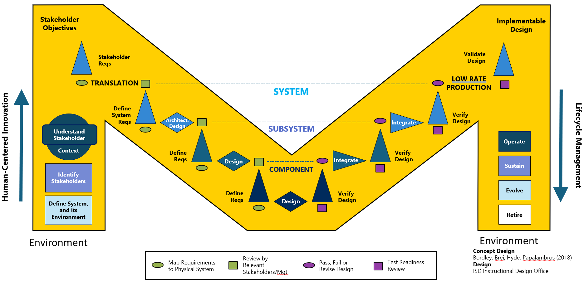
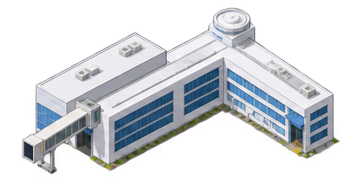
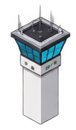
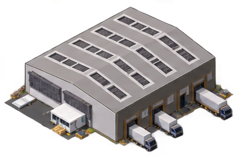
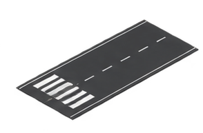
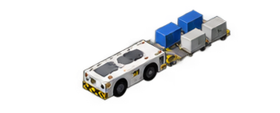
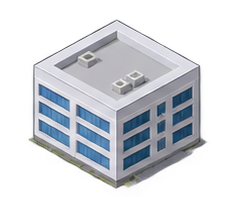
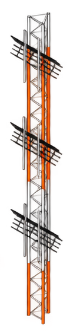
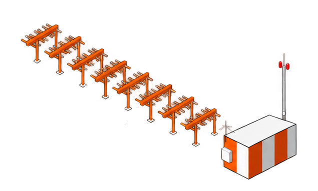

# Journal — 2026-09-19

## 11:36 — Sign-On

**What was worked on and why:** Restructured `cameo_models/tutorial.sysml` — previously
generic SysML v2 tutorial content (an Airport/Aircraft/Flight practice exercise, per
`cameo_models/sysmlv2_exploration.md`) — into the project's actual System of Interest
structure: the NAS composed of its 9 D-002 domains (Governance, Airspace Management,
Airspace Resources, Flight Operations, Airport Operations, Aircraft Systems, Information
Services, Infrastructure, Decision Support), each populated with constituent systems drawn
from `knowledge/models/candidate-systems-inventory.md`. Per the user's instruction, only
systems inside the provisional SOI boundary were populated — non-US regulators (EASA,
CAAC), ICAO, other transport modes, military/general-aviation content, and inventory items
the source itself couldn't confirm (ETFMS, AMAN, GMTOs/ANSPs) were left out and flagged
rather than guessed in.

The user was actively editing the same file live while this was happening (added
`AircraftState`, engine attributes) — paused to ask how to proceed rather than silently
overwriting; user chose to have the restructure proceed on the current snapshot, folding
their in-progress additions in.

**What changed:**
- `cameo_models/tutorial.sysml` — full rewrite: `Common` package (value types: Position,
  DateTime, Operator, Passenger, Cargo), a top-level `NationalAirspaceSystem` part
  composing 9 domain packages, each domain's constituent systems per the inventory. Fixed
  the pre-existing `Airpot` typo and inconsistent `partdef`/`part def` usage. Also fixed
  real SysML v2 grammar errors surfaced by the IDE's language server after the rewrite:
  `Float` isn't a valid scalar type (renamed to `Real`), `List<T>` generics aren't valid
  syntax (converted to `T[*]` multiplicity), attributes can't be typed by a `part def`
  (converted Position/DateTime/Operator/Passenger/Cargo/AircraftState to `attribute def`,
  and cross-domain references like `Flight.aircraft` to `ref part`), `state` is a reserved
  keyword (renamed `Aircraft.state` to `flightState`), and imports need explicit
  visibility (`public import ScalarValues::*;`). File now lints clean.
- `to-do-list.md` §10 — checked off "Create package/model organization" and "Create
  system BDDs" as a first pass, noting both are draft SysML text not yet reconciled into
  Cameo.
- `knowledge/questions/open-questions.md` — added a "SysML draft reconciliation (§10)"
  section: Cameo reconciliation still pending, three inventory items need verification
  before being added (ETFMS/AMAN/GMTOs/ANSPs), and the systems in this draft aren't yet
  traced to any formal stakeholder need/requirement.
- `task-board.md` — added an Active bullet pointing at this work.

**What's blocked:** Nothing blocking. The draft needs a Cameo reconciliation pass
whenever Cameo modeling actually starts on this project (no target date set for that
yet).

## PM check-in (`persona-pm`)

Scoped to §10 ("Build the SysML Architecture"), the section touched this session — not a
full re-derivation of §1-§9.

- **Create package/model organization** (ECD 2026-11-03) — **Done** (first pass). 45 days
  ahead of ECD.
- **Create system BDDs** (ECD 2026-11-03) — **Done** (first pass, SOI-filtered). 45 days
  ahead.
- **Create NAS context diagram** (ECD 2026-09-07) — **Slipped**, 12 days past ECD,
  unchecked. Not touched this session.
- **Create stakeholder model** (ECD 2026-09-07) — **Slipped**, 12 days past ECD,
  unchecked.
- **Create responsibility swimlanes** (ECD 2026-09-10) — **Slipped**, 9 days past ECD,
  unchecked.
- **Create critical sequence diagrams** (ECD 2026-09-22) — **At risk**, 3 days out,
  unchecked.

Three §10 milestones with passed ECDs are still unchecked, and a fourth is due in 3 days
with no visible start. The two items worked this session were comfortably ahead of
schedule but weren't the ones actually due. **Recommendation:** next §10 session should
target the NAS context diagram and stakeholder model directly — both are smaller, faster
artifacts than the BDD work just done, and closing them stops the slip count from growing
before the sequence-diagram ECD also passes.

## Next steps

1. Create the NAS context diagram (§10, slipped since 2026-09-07) — what's outside the
   NAS boundary (other transport modes, ICAO/foreign regulators) that it interfaces with,
   using the exclusions already documented in `tutorial.sysml`'s header comment.
2. Create the stakeholder model / stakeholder map (§10, slipped since 2026-09-07) — likely
   derivable from the existing PESTLE work in `knowledge/models/stakeholder-register.md`.
3. Verify ETFMS/AMAN/GMTOs/ANSPs against real FAA nomenclature (or literature) before
   adding them to `tutorial.sysml`'s Airspace Management package — see
   `open-questions.md`.

## 11:52 — Sign-Off

**What was worked on and why:** The user asked for standing capability to keep expanding
the SysML v2 model going forward — instantiating concrete things (a specific flight, its
route, airports, SIDs/STARs/approaches) rather than just structural definitions — and to
incorporate a Python-based vehicle-physics model that can simulate aircraft motion/state
change, wired back to the architecture. They explicitly asked for new skills/workflows to
support this recurring work, and for me to research the SysML v2 mechanics needed to do
it correctly rather than guess.

Researched (web search + fetch) two open questions before building anything: (1) how
SysML v2 represents concrete instances (`individual` is a real modifier for
occurrence-with-a-lifetime semantics, but no worked example was findable in public docs
as of today — used the better-documented "usage + bound values" pattern instead), and (2)
how SysML v2 connects to external code for simulation (the only broadly-implemented
`calc def` external-language path runs through Jython in specific commercial tools, not
CPython — ruled out embedding real physics as literal Python text in a `.sysml` file).

**What changed:**
- New workflow `workflows/sysml-instance-modeling.md` — the instance/scenario-modeling
  process, plus a written-up list of verified SysML v2 syntax rules learned this session
  and the previous one via this project's IDE language-server diagnostics (scalar types,
  multiplicity syntax, `ref part` vs. `part`, reserved words, and — new this session —
  that redefining a composite feature with a nested body needs `:>>` *and* the type
  restated, or every member inside gets misresolved).
- New workflow `workflows/vehicle-simulation-model.md` — the physics-integration pattern
  (interface in SysML, real implementation in Python, hand-maintained doc-comment trace
  between them) and why (D-005).
- Two new skills, `sysml-instance-modeling` and `vehicle-simulation-model`, thin wrappers
  per this repo's existing pattern.
- `cameo_models/tutorial.sysml` — added four procedure `part def`s to `AirspaceManagement`
  (StandardInstrumentDeparture, StandardTerminalArrival, InstrumentApproachProcedure,
  EnrouteSegment) and a `VehicleDynamicsModel` capability (with a `StepDynamics` calc def
  interface) to `DecisionSupport`, giving that domain its first constituent content.
- `cameo_models/scenarios/hub-to-hub-example.sysml` (new) — an end-to-end illustrative
  scenario: two airports, a SID and an approach procedure, an aircraft with a concrete
  initial `AircraftState`, and a flight referencing all of them. Lints clean, including
  cross-file references into `tutorial.sysml`'s packages.
- `simulation/vehicle_dynamics.py` (new) — a point-mass kinematic vehicle dynamics model
  (`step_dynamics`): speed/heading rate-limited toward commanded values, altitude from
  commanded climb rate, horizontal position via an equirectangular projection, placeholder
  constant fuel burn. Field names mirror `AircraftState` exactly.
- `simulation/test_vehicle_dynamics.py` (new) — four smoke tests, all passing (holding
  commanded state holds track; climb command changes altitude correctly; speed change is
  rate-limited; fuel burns while engine on).
- `decisions/decisions-log.md` — new D-005 (the file-layout/integration decisions above).
- `index.md` — added D-005 to the decisions list and updated the repository map for
  `cameo_models/scenarios/` and the new `simulation/` folder.
- `to-do-list.md` — checked off §12's "Develop minimum viable simulation" and "Validate
  constituent models independently," and §13's "Trace simulation entities to SysML
  blocks" and "Trace simulation inputs to information objects/interfaces" (all first-pass,
  noted as such).
- `open-questions.md` — new "Scenario / simulation content" section: the demo scenario's
  placeholder procedure names, the kinematic-only fidelity of the physics model, and the
  unconfirmed `individual` SysML keyword.
- `task-board.md` — added an Active bullet for this work.

**Incidental finding, not acted on:** `index.md`'s decisions list names D-003 and D-004,
but `decisions/decisions-log.md` only had full entries for D-002 and D-001 before today —
D-003/D-004 appear to be missing their actual log entries. Didn't fix this (out of scope
for today's task) but flagging it since it means the decisions log is currently
incomplete relative to what index.md claims.

**What's blocked:** Nothing blocking.

## Next steps (supersedes the §10-context-diagram list above for the *next* session)

1. Verify or replace the demo scenario's placeholder procedure names (BENKY4, ILS RWY
   22L) — or replace the whole scenario once a real ConOps scenario/city-pair is decided.
2. Still open from this morning: create the NAS context diagram and stakeholder model
   (§10, both slipped since 2026-09-07).
3. If more simulation fidelity is needed, extend `simulation/vehicle_dynamics.py` rather
   than starting a parallel model — see `workflows/vehicle-simulation-model.md`.
4. Consider fixing the missing D-003/D-004 decisions-log entries (see incidental finding
   above) next time decisions-log.md is touched.

# Images 

