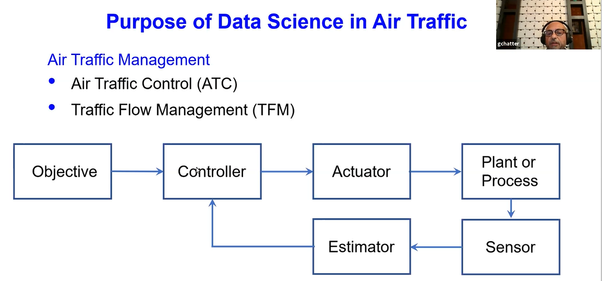
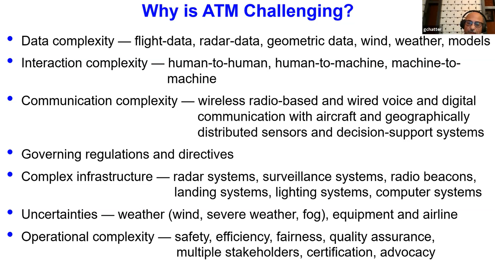
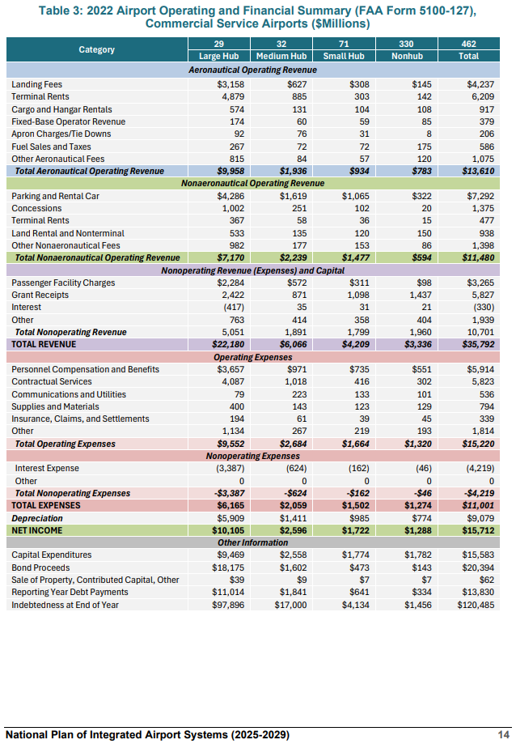
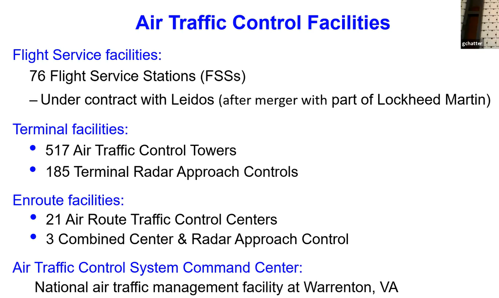
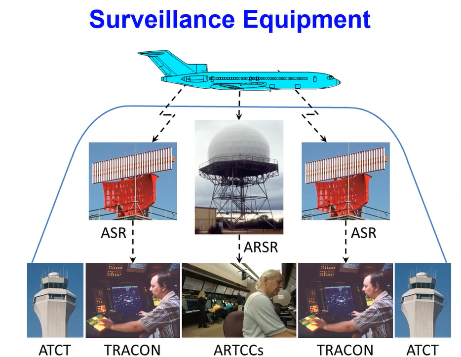
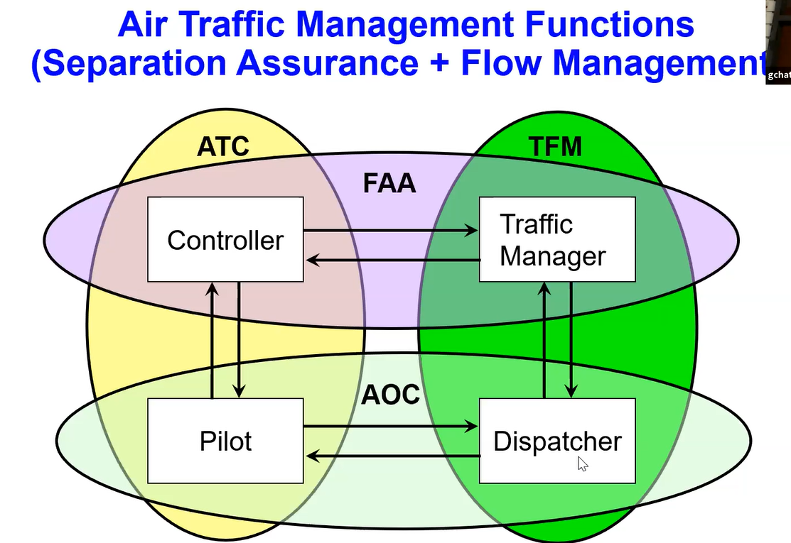
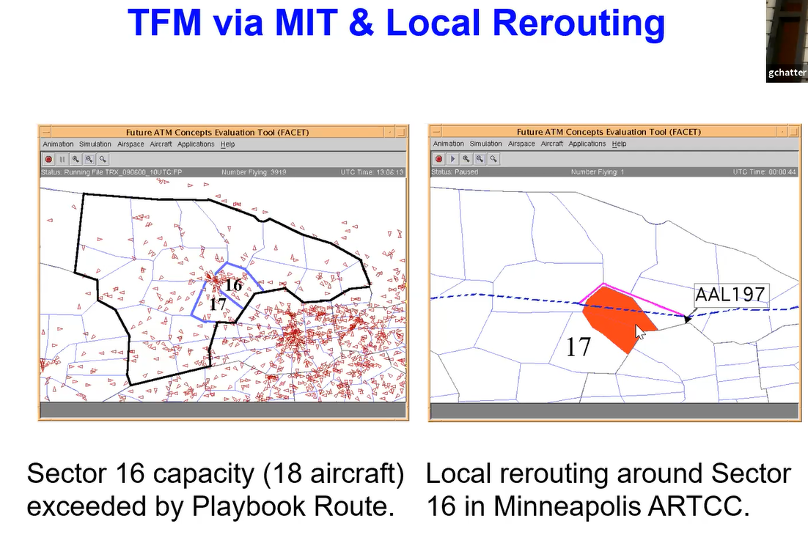
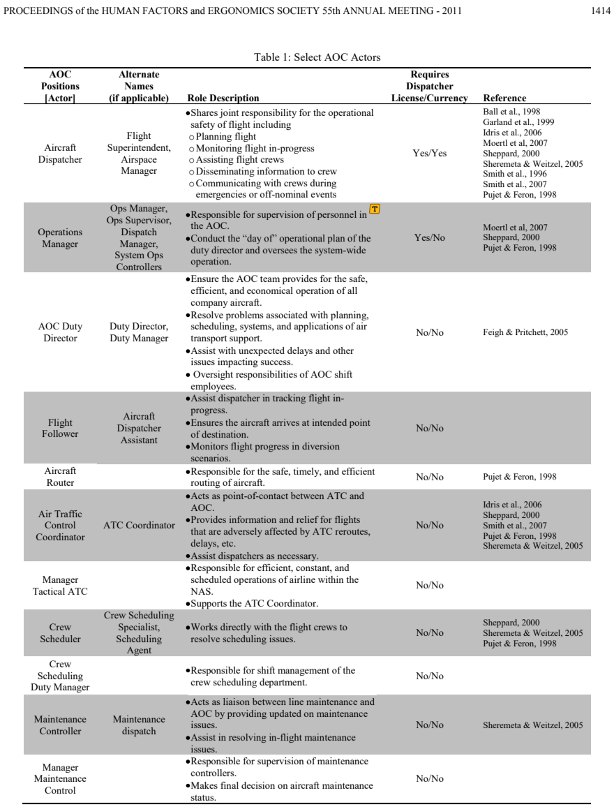
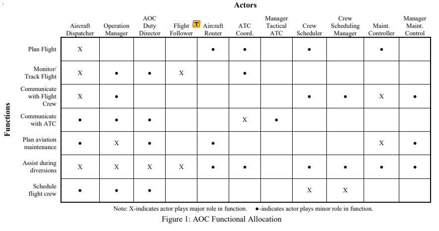
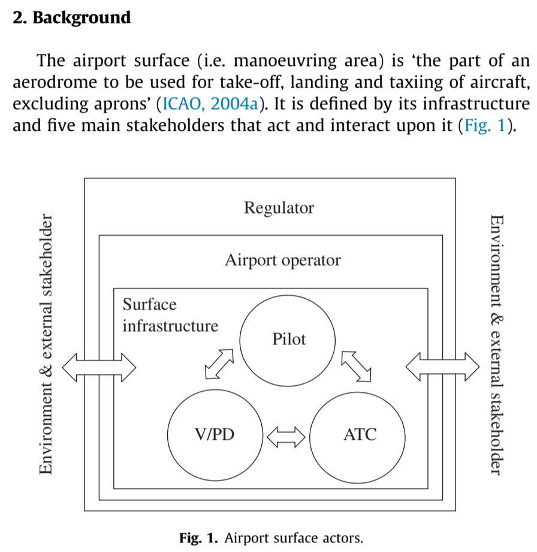

# Journal — 2026-09-20

## 15:00 — Sign-On

**Session plan (the user's, stated at start):** finalize stakeholder objectives by drafting
personas for every stakeholder — and for the constituents within each stakeholder, where
that level of detail applies. This continues the uncommitted edits already in the working
tree at sign-on (`stakeholder-objective-ontology.md`, `stakeholder-personas.md`,
`systems_engineering.md`, `references.bib`, plus the untracked Berry & Pace 2011 AOC PDF
in `evidence/sources/`).

**Decisions / status stated by the user this session:**

- **NAS context diagram — considered closed.** It lives on the user's Miro board (not in
  the repo) and is what the stakeholder list was derived from. `to-do-list.md` §10 "Create
  NAS context diagram" (ECD 2026-09-07) is still unchecked; check it off at sign-off if
  the user confirms the Miro diagram satisfies the milestone's "Context diagram"
  deliverable, and consider linking or exporting it into the repo so the trace from
  diagram to stakeholder register is inspectable there.
- **Critical sequence diagrams (§10, ECD 2026-09-22) — not starting yet, on purpose.** The
  user's read is that scenario ConOps needs more headway first. They can lay out a
  sequence diagram now, and have relevant pre-work from a prior class (ISD 521 term
  project — Deliverable 4 report and models, kept outside this repo), but that work
  doesn't map to the stakeholders/actors/systems the user expects to settle on, so it
  wouldn't meet the milestone's "message completeness" metric as-is. The 2026-09-22 ECD
  is therefore likely to slip; that is a deliberate sequencing choice (actors first,
  then messages), not an unnoticed miss. Reconcile the ISD 521 material against the
  final actor list once it exists rather than adapting it now.

**Carried in from the 11:36/11:52 sign-offs and the sign-on recap, unchanged:** SOI
boundary still provisional and not logged as a decision; D-003/D-004 entries missing from
`decisions/decisions-log.md`; §9 RACCI/authority items and §10 responsibility swimlanes
past their 2026-09-10 ECD; demo scenario's placeholder procedure names (BENKY4, ILS RWY
22L) still unverified; Berry & Pace 2011 PDF apparently not yet registered in
`evidence/source-register.md`.


## Manual Notes
Reviewed new source [NASA Presentation](https://ntrs.nasa.gov/citations/20205001251). Captured content: 


Note about ATC's humble beginnings: 
```Our Chief William league at Lewis Lambert Municipal Airport
in 1929. He was the first air traffic controller. He was a pilot and
engine and an aircraft mechanic. He had a
degree in aeronautical  engineering from Washington State in St. Louis, and he
retired as a system administrator of the FAA```

[FAA Factbook](https://www.faa.gov/newsroom/faa-fact-book):
 - NAS 90.7 on-time performance in 2023
  - 848,800 pilots in 2024 + 345,500 student pilots
  - FAA workforce is 43,992 in 2022.
  - 19,869 airports in 2024
  - 0.3433 accidents per 100,000 departures in 2023
  
Airport Profits:


ATC Facilities Breakdown:


ATC Equipment
 - Airport Surface Detection Equipment (ASDE-X)
 - Airport Surveillance Radar (ASR)
 - Air Traffic Control Radar Beacon Ssytem (ATCRBS)
 - Automated RAdar Terminal System (ARTS)
 - ARTCC En-Route Automation Modernization (ERAM)
 - Direct Access Radar Channel (DARC)
 - Very High Frequency Omni Range (VOR)
 - Tactical Air Navigation System (TACAN)
 - Aircraft Communications, Addressing, and Reporting System (ACARS) & Voice Communications

ATC Surveillance Flow:


Division of responsibility between FAA & AOC w.r.t. separation assurance and flow management: 


An airline's main product is the schedule of flights. A dispatcher "flies a schedule". AOC coordiantes flight planning, resource scheduling, and flight following.

ATC controller flow
### ATC Organization, Roles, and Separation

- **Tower controllers**
    - **Clearance Delivery** — handles flight/ATC clearance information before departure.
    - **Ground Controller** — directs aircraft taxi from the gate/ramp area toward the active runway.
    - **Local Controller (Tower)** — sequences aircraft into the local traffic flow and maintains separation between arriving and departing traffic.
- **TRACON / Terminal controllers**
    - Receive aircraft from the local/tower controller after departure and manage them through the terminal area.
    - Eventually hand aircraft off to the **ARTCC / en-route center**.
    - Correspondingly manage arriving aircraft before handing them to the tower.
- **Flight Progress Strips**
    - Contain operational information such as:
        - Aircraft identification and type
        - Collision-avoidance/equipment information
        - Computer identification
        - Proposed departure time
        - Requested altitude
        - Remarks
    - Historically provided a physical means of tracking and coordinating flights and could serve as a backup if computer/radar systems failed.
- **ARTCC / Center controller team**
    - **Radar Controller** — monitors the plan-view display and is primarily responsible for aircraft separation.
    - **Data/Assistant Controller** — maintains flight-progress information/strips and supports separation, including in non-radar environments.
    - **Traffic Management Unit (TMU)** — manages traffic demand so individual sectors/controllers are not overloaded.
        - Coordinates traffic flow with neighboring centers.
        - Uses **Traffic Flow Management (TFM)** systems for demand prediction.
        - Can impose flow restrictions, including holding aircraft on the ground or slowing inbound traffic.
- **Two primary ATM objectives**
    - **Safety** — maintain required aircraft separation and prevent congestion/overload.
    - **Efficiency** — maintain traffic throughput and coordinate flows across the NAS.
    - **ATC centers** primarily manage aircraft separation and local/regional throughput.
    - **Central/national flow management** coordinates across ATC centers to manage congestion and overall NAS traffic flow.
- **Aircraft separation**
    - Separation can be achieved **laterally or vertically**.
    - Lecture gives nominal values of:
        - **5 NM lateral**, or
        - **1,000 ft vertical**.
    - **3 NM lateral separation** can apply under specified terminal/radar conditions, including aircraft within 40 NM of the radar antenna using an appropriate single radar source.
    - Multiple radar sources can be fused by ATC automation to establish the aircraft's surveillance position.

    The input
to the traffic flow management is the traffic demand and your flow
constraints like airport capacity airspace capacity and the objective
of this optimization is to maximize or minimize delays distribute delays equitably and
also include user preference.

Controllers have "Playbook Routes", which are common re-routes to avoid weather in ceratin regions (e.g. minneapolois center  using West Watertow Playbook Rotue). 

Can have local re-routes to go around sectors that are overloaded: 



Another potential source from 2018: [Managing Variability: A Cognitive Ethnography of the Work of Airline Dispatchers](https://ntrs.nasa.gov/citations/20180003081)

Another potential source from 2016: [icao-doc-9854-global-atm-ops-concept.pdf](https://skylibrarys.wordpress.com/wp-content/uploads/2016/07/doc-9854-global-atm-ops-concept.pdf)
Aircraft Operator / Airline
│
├── Corporate / Strategic Management
│   ├── Executive leadership
│   ├── Network planning
│   ├── Schedule planning
│   ├── Fleet planning / assignment
│   ├── Finance / revenue management
│   └── Sustainability / environmental strategy
│
├── Airline Operations Control Center (AOC/OCC)
│   ├── Operations control / duty manager
│   ├── Flight dispatch
│   ├── Aircraft control / fleet control
│   ├── Crew control
│   ├── Maintenance control
│   ├── Meteorology
│   ├── Load control
│   └── Irregular-operations / recovery management
│
├── Flight Operations
│   ├── Captain
│   ├── First Officer
│   └── Cabin crew
│
└── Station / Airport Operations
    ├── Station manager
    ├── Gate/customer-service agents
    ├── Ramp coordination
    └── Airline ↔ ground-handler coordination

Air Navigation Service Provider / FAA ATO
│
├── National / Network Traffic Management
│   └── ATCSCC: Its job is explicitly to balance nationwide traffic demand against system capacity
│       ├── National Operations Manager
│       ├── National Traffic Management Officer
│       └── National Traffic Management Specialists
│
├── En-route Traffic Management
│   └── ARTCC
│       ├── Traffic Management Officer
│       ├── Supervisory TMC
│       ├── Traffic Management Coordinators
│       └── Area / sector controllers
│
├── Terminal Airspace
│   └── TRACON
│       ├── Traffic management
│       ├── Arrival controllers
│       └── Departure controllers
│
└── Airport ATC
    └── ATCT
        ├── Local / tower controller
        ├── Ground controller
        ├── Clearance delivery
        └── Traffic-management functions

The  FAA  coordinates up to 50,000 flights in the U.S. per day; over a quarter of the world’s scheduled flights arrive at or depart from U.S. airports. With 5,000 aircraft in the nation’s skies during the busiest periods, numerous experts from government agencies and the aviation industry work seamlessly through a process called collaborative decision making to manage current and future constraints in the system. They discuss flight planning, weather, runway construction, the movement of dignitaries, and other issues that may impact the system. Stakeholders include:

Air Route Traffic Control Centers (ARTCCs)
Terminal Radar Approach Control Facilities (TRACONs)
Air Traffic Control Towers (ATCTs)
Aviation Industry Partners
The ATCSCC Team uses traffic management initiatives (TMIs) to manage the flow of air traffic and minimize delays. TMIs may include:

Airborne Metering,
Miles-in-Trail,
Reroutes,
Ground Delay Programs,
Ground Stops,
Airspace Flow Programs
TMIs are also used to mitigate the impact of NAS events caused by:

Weather,
Equipment Outages,
Runway Closures,
National Emergencies

ATCSCC / National TFM
        ↓
strategic / network

ARTCC / TRACON traffic management
        ↓
regional / flow

Sector / approach / tower controller
        ↓
tactical / individual aircraft


Airport Ecosystem
│
├── Airport Operator
│   ├── Airport operations center
│   ├── Airfield operations
│   ├── Terminal operations
│   ├── Facilities / infrastructure
│   ├── Gate / stand allocation
│   ├── Safety / emergency management
│   └── Airport strategic management
│
├── ANSP / ATC
│   ├── Tower
│   └── Ground control
│
├── Aircraft Operator / Airline
│   └── Station operations
│
├── Ground Handling Organizations
│   ├── Ramp
│   ├── Baggage
│   ├── Cargo / mail
│   ├── Pushback / towing
│   ├── Cleaning
│   ├── Potable water / lavatory
│   ├── Deicing
│   └── load / turnaround services
│
├── Fuel Provider
│
├── Catering Provider
│
├── Aircraft Maintenance / MRO
│
├── Passenger Services
│   ├── Check-in
│   ├── gate
│   └── passenger assistance
│
├── Government Services
│   ├── TSA
│   ├── CBP
│   ├── police
│   └── fire / ARFF
│
└── Commercial / Landside Services
    ├── concessions
    ├── parking
    ├── rental cars
    └── ground transportation


NAS
│
├── Aircraft Operators / Airspace Users
│   │
│   ├── Commercial Airline
│   │   ├── Corporate / Network Planning
│   │   ├── Operations Control Center
│   │   │   ├── Dispatch
│   │   │   ├── Fleet Control
│   │   │   ├── Crew Control
│   │   │   └── Maintenance Control
│   │   ├── Flight Crew
│   │   ├── Cabin Crew
│   │   └── Station Operations
│   │
│   ├── Business Aviation
│   ├── General Aviation
│   ├── Military
│   └── UAS
│
├── Air Navigation Services
│   ├── National Traffic Flow Management
│   ├── ARTCC / En-route
│   ├── TRACON / Terminal
│   └── Tower / Surface
│
├── Airport Ecosystem
│   ├── Airport Operator
│   ├── Ground Handler
│   ├── Fuel Provider
│   ├── Catering
│   ├── MRO
│   ├── Concessions
│   └── Passenger / baggage services
│
└── Governance / External Stakeholders
    ├── FAA
    ├── DOT
    ├── TSA / DHS
    ├── EPA
    ├── State / Local Government
    ├── Communities
    ├── Passengers
    └── Environment / public interest

Does this actor have an objective, constraint, decision authority, information requirement, or MOP/MOE that is materially different from its parent?

## Reference sweep (process-references)

Processed 7 new files in `evidence/sources/` (register now 59 of 59): `icao2005doc9854` (5), `seamster2011collabSystems` (5, draft report), `berry2011aocActors` (4), `munro2018managingVariability` (4), `wilke2014airportSurface` (4), `honour2010seRoi` (3), `honour2011sizingSE` (2). No exact duplicates; nothing rated 0-1.

Flagged: the "Eric C. Honour ..." PDF is the 2010 INCOSE paper, not the 2013 thesis in `honour2013seRoi`, and neither Honour paper contains the 40% / 30% / 3.5:1-7:1 figures that `knowledge/models/systems_engineering.md` cites to "Honour, 2013" (they do support the ~15-20% optimum SE effort). Also: the second Honour file's name says 2014 but it is INCOSE 2011; Seamster et al. is a draft; Munro & Mogford's venue was confirmed by web search.

Next: the AOC/FOC role cluster (`berry2011aocActors`, `seamster2011collabSystems`, `munro2018managingVariability`) is ready to feed the OCC-group persona stubs.


AOC Actors


AOC functional allocation:



### Review of Managing Variability - A Cognitive Ethnography of the Work of Airline Dispatchers
Once he/she has completed flight planning the dispatcher ‘releases’ the plan, i.e., makes it available to other work groups throughout the airline (e.g., pilots, load planners, ramp controllers, etc.), who use it to support their own work processes. Many operations cannot begin until the release is available. For example, ramp controllers cannot generate the fuel slips that must be sent to fuel trucks in order to begin fueling the aircraft until the total fuel quantity needed is received via the release. As they begin working with the release these work groups may discover some of the predictions on which it was based were not accurate or that situational factors have changed. They communicate this information to the dispatcher who must amend and update the release.
Schedule release time. Each dispatch release has an assigned time by which it must be completed, known as the ‘schedule release time’. Airlines in this study had schedule release times of between 60-90 minutes before domestic departures and 120 minutes before international departures. A dispatcher can, however, choose to release a flight earlier than the schedule release time. Indeed this was often done when a dispatchers had multiple releases due at roughly the same time. Dispatchers were sensitive to meeting their airline’s release times not only because it was a metric on which their own performance was evaluated, but also because they were aware the impact a late release had on other work groups. (Indeed it was observed that some stations would telephone the dispatcher when a release went as few as five minutes beyond its scheduled time). Flight plans were generally sent to ATC 45-60 minutes before departure for domestic flights and 60-90 minutes for international flights.

This study identified five key planning tasks: checking weather, choosing a route, selecting alternates, reviewing NOTAMs, and planning fuel.

Potential sub-activity in flight operations:
Fuel planning involves calculating not only the amount of fuel necessary to fly from the departure to destination airports along the selected route, but also the amounts needed for each phase of operation, such as taxi out, taxi in, holding, diversion to an alternate, etc. The plan must further demonstrate that upon landing the flight will meet the minimum reserve fuel requirements (45 minutes flying time). The dispatcher must also verify that the planned fuel will not put the aircraft over any structural and performance limits (e.g., max takeoff weight, max landing weight).

One of dispatchers’ greatest concerns was the risk of missing some small detail in the reams of data they must review while planning a flight, e.g., an airspace restriction, a fuel penalty in an MEL, or a detail in a weather forecast that could negatively impact the flight. Even if no details were missed, dispatchers knew from experience that events out of their control routinely occurred during revenue flights (e.g., ATC clearances, weather, mechanical issues).

Safety -> tolerance stack up -> flight inefficiency, possibly alleviated by better flight planning tools w/more realistic accounting for stochastic processes.
Ensuring the flight crew had sufficient contingency fuel to successfully manage any such events was a top priority for dispatchers. To accomplish this they quite frequently rounded up individual fuel quantities to add an additional margin of safety. For example, one dispatcher who had calculated that 270 pounds of fuel would be needed for taxi out rounded the quantity up to an even 300 pounds. This strategy was also applied to each of the other planned fuel quantities for that flight (e.g., taxi, enroute, holding, diversion, etc.) After summing these individual fuel quantities to get a total fuel quantity, dispatchers would frequently round up the total fuel number to add an additional margin for contingencies.

Load planning. Dispatchers often began flight planning using an initial estimate of the aircraft’s zero fuel weight (ZFW) provided by the airline’s load planners.

Although dispatchers expected that the ZFW would fluctuate as payload figures became more refined leading up to departure, the only visual indication that a ZFW had changed was a change in the numbers in the ZFW field. It was not uncommon for this to occur while the dispatcher’s
attention was focused on other tasks.To track changes dispatchers could attempt to memorize the current ZFW for each flight, but the well-documented vulnerabilities of short-term memory make this a risky strategy. Writing each ZFW on a piece of paper would offload some of the memory burden while bringing a host of other vulnerabilities.

To eliminate the need to recalculate with every small fluctuation, dispatchers added buffers to the initial ZFW. At Airline A there was a wellknown and accepted practice for dispatchers to add 1,000 pounds to the initial ZFW received from load planning. In thisway if load planning needed, for example, 800 additional pounds for cargo or passengers, this could be accommodated without requiring the dispatcher to recalculate fuel.
Interestingly, load planners at the airline reported they had a practice of adding their own 1,000-pound buffer to the ZFW before sending it to dispatch as a means of holding space for additional payload. Thus fuel planning began with a total of 2,000-pounds of buffer built into the ZFW.

Conflict between stakeholders w/in Airline:
While the regulations hold dispatchers responsible (along with the PIC) for planning enough fuel to safely conduct the flight (with adequate margins for unforeseen events), airlines sent clear messages to dispatchers that they were also expected to support company business goals by keeping fuel costs down and by accommodating more paying passengers or cargo.

Pilots. Load planning was not the only source of variability to fuel planning. Once the dispatcher releases a flight, the captain, as PIC, must review the plan and decide whether to accept it as-is or request changes. One of the most common changes captains requested was additional fuel. Requests typically came during telephone briefings with the dispatcher or via ACARS messages once pilots were onboard.

### Airport surface operations - A holistic framework for operations modeling and risk management



The FAA lays out th responsibiliites of different actors w/in the various ATC forms on [their website](https://www.faa.gov/air_traffic/publications/atpubs/atc_html/chap2_section_10.html), which defines teh following terms: 
  - Sector. The area of control responsibility (delegated airspace) of the en route sector team, and the team as a whole.  
  - Radar Position (R). That position which is in direct communication with the aircraft and which uses radar information as the primary means of separation.
Radar Associate (RA). That position sometimes referred to as “D-Side” or “Manual Controller.”
  - Radar Coordinator Position (RC). That position sometimes referred to as “Coordinator,” “Tracker,” or “Handoff Controller” (En Route).
  - Radar Flight Data (FD). That position commonly referred to as “Assistant Controller” or “A-Side” position.
  - Nonradar Position (NR). That position which is usually in direct communication with the aircraft and which uses nonradar procedures as the primary means of separation.

  [Traffic Management Procedures](https://www.faa.gov/air_traffic/publications/atpubs/atc_html/chap11_section_1.html
  11-1-2. DUTIES AND RESPONSIBILITIES
Supervisory Traffic Management Coordinator-in-Charge (STMCIC) must:
Ensure an operational briefing is conducted at least once during the day and evening shifts. Participants must include, at a minimum, the STMCIC, Operations Supervisor-in-Charge (OSMIC)/Controller-in-Charge (CIC) and other interested personnel as designated by facility management. Discussions at the meeting should include meteorological conditions (present and forecasted), staffing, equipment status, runways in use, Airport Arrival Rate (AAR), TBM use, and Traffic Management Initiatives (TMIs) (present and anticipated).
Assume responsibility for TMC duties when not staffed.
Ensure that TBM operations and TMIs are carried out by personnel providing traffic management services.
Where authorized, perform EDST data entries to keep the activation status of designated EDST Airspace Configuration Elements current.
Perform assigned actions in the event of an EDST outage or degradation, in accordance with the requirements of FAA Order JO 7210.3, Facility Operation and Administration, and as designated by facility directive.
Ensure changes to TBM operations and TMIs are implemented in a timely manner.
OS/CIC must:
Keep the TMU and affected sectors apprised of situations or circumstances that may cause congestion or delays.
Coordinate with the TMU and personnel providing air traffic services to develop appropriate TBM operations or TMIs for sectors and airports in their area of responsibility.
Continuously review TBM operations and TMIs affecting their area of responsibility and coordinate with TMU for extensions, revisions, or cancellations.
Ensure that TBM operations and TMIs are carried out by personnel providing air traffic services.
Where authorized, perform data entries to keep the activation status of designated EDST Airspace Configuration Elements current.
Perform assigned actions in the event of an EDST outage or degradation, in accordance with the requirements of FAA Order JO 7210.3, Facility Operation and Administration, and as designated by facility directive.
Ensure changes to TBM operations and TMIs are implemented in a timely manner.
Personnel providing air traffic services must:
Ensure that TBM operations and TMIs are enforced within their area of responsibility. TBM operations and TMIs do not have priority over maintaining:
Separation of aircraft.
Procedural integrity of the sector.
Keep the OS/CIC and TMU apprised of situations or circumstances that may cause congestion or delays.
Continuously review TBM operations and TMIs affecting their area of responsibility and coordinate with OS/CIC and TMU for extensions, revisions, or cancellations.
Where authorized, perform data entries to keep the activation status of designated EDST Airspace Configuration Elements current.
Perform assigned actions in the event of an EDST outage or degradation, in accordance with the requirements of FAA Order JO 7210.3, Facility Operation and Administration, and as designated by facility directive.
ARTCCs, unless otherwise coordinated, must:
Support TBFM operations and monitor TBFM equipment to improve situational awareness for a system approach to TBM operations.
Monitor arrival flow for potential metering actions/changes and, if necessary, initiate coordination with all facilities to discuss the change to the metering plan.
TRACONs, unless otherwise coordinated, must:
Support TBFM operations and monitor TBFM equipment to improve situational awareness for a system approach to TBM operations.
Monitor arrival flow for potential metering actions/changes and, if necessary, initiate coordination with all facilities to discuss the change to the metering plan.
Schedule internal departures in accordance with specific written procedures and agreements developed with overlying ARTCCs and adjacent facilities.
ATCTs, unless otherwise coordinated, must:
Monitor TBFM equipment to improve situational awareness for a system approach to TBM operations.
When equipped, and departure scheduling is in effect, use automation to obtain a departure release time from the TBM system.
When departure scheduling or Call for Release is in effect, release aircraft so they are airborne within a window that extends from 2 minutes prior and ends 1 minute after the assigned time, unless otherwise coordinated.)

Willems and Koros (2007) reviewed six ATC task analyses. They aggregated 33 core tasks and grouped them under the following six core tasks:
 - Maintain situation awareness of the traffic in the sector 
 - Develop and receive sector control plan (anticipate action, process flight data, manage
traffic)
 - Make decision for control actions 
 - Solve aircraft conflicts (provide separation and prevent conflicts)
 - Provide tactical Air Traffic Management (e.g., provide instructions, coordinate pointouts and handoffs, manage arrivals & departures, relay information, manage emergencies, handle communications, handle flight data)
 - Update working knowledge or supervise


## Seamster interaction extraction and 7110.65BB mapping

Extracted the interaction tables from `seamster2011collabSystems` with a new script (`tools/extract_seamster_interactions.py`): 702 interaction rows over 32 tables (Tables 2.1–2.10, 3.1, A, C, D, and the E-1..E-13 matrix = 277 rows), 100.00% page-token coverage, every E-page grid row accounted for, output byte-identical across runs; E-7, 2.10 and 3.1 checked row-by-row against rendered pages. Data: `evidence/literature-notes/annotations/seamster2011collabSystems-interactions.{md,csv}`; annotation: `annotations/seamster2011collabSystems.md`.

Added `7110.65BB_Basic_dtd_2-20-25.pdf` to the register (`faa2025jo711065bb`, rated 5) and mapped ATC interactions to candidate BB paragraphs by keyword rules (`-bb-rules.csv`; a candidate list, not row-by-row verification; the report itself cites 7110.65**T**, not BB, and cites it only in narrative).

New model note `knowledge/models/interaction-catalog-flight-execution.md`: actor crosswalk (source roles → personas, with the abstraction and why), phase crosswalk, the to-do §4 control-transition catalog, off-nominal chains, §9 friction seeds. Added Notes-line mappings to 21 personas (no other persona field touched, no stubs added); glossary terms, candidate systems, open questions and a to-do §4 status note added. §4 checkboxes left unchecked on purpose: BB paragraphs were located, not read for decision authority.

Findings worth your attention: (1) BB ¶2-10-1 defines both Radar Associate ("D-side") and Radar Flight Data ("A-side") — the "Data / Assistant Controller" stub name spans both; (2) the nominal Final Approach table (E-11) has no explicit "clear to land" row — only `E-12#35`; (3) BB has no paragraph on PDC by name or on pushback; (4) the report reports 277 interaction rows in Appendix E versus "a little over 300 entries" — nothing was dropped (100% token coverage), so this is a counting difference in the report.

Owner decisions logged in `knowledge/questions/open-questions.md` ("Actor abstraction"). Not committed.

