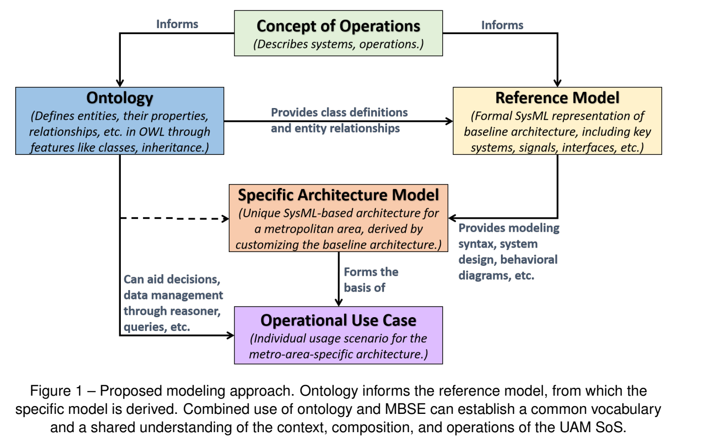
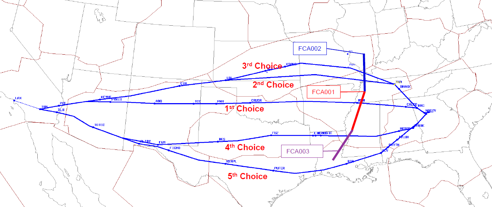

# Journal — 2026-09-23

## 21:01 — Welcome

**Recap:**
- Interim Report #1 submitted 2026-09-17; SOI ratified (D-007) and reconciled into the BDD (D-008). Interim #2 is due Oct 25.
- In flight: the context-diagram connection set (Flight Ops / Flight Crew / Airspace Mgmt / Airport Ops / Aircraft Systems) was reasoned out at last sign-off, but it isn't confirmed as committed to `nas_context_diagram.sysml`.
- Loose ends: Information Services / Decision Support placement in `Environment` vs. D-007's "absorbed" disposition; Flight Crew role split; Seamster crosswalk actor questions; placeholder scenario procedures.

**Focus picks (Professor):**
1. Get the connection block into `nas_context_diagram.sysml` and check it against the model — reasoning that isn't in the model gets re-derived or drifts, and the context diagram (§10) has slipped since 09-07.
2. Resolve Information Services / Decision Support placement — D-008 contradicts D-007 on this, and it decides where `VehicleDynamicsModel` sits for §12-13 traceability.
3. Reconcile the stakeholder/actor view to D-007 — the other slipped §10 item, and it shares the Seamster actor-abstraction questions with pick 2's Flight Crew split.

## Manual Notes

[FAA CTOP](https://cdm.fly.faa.gov/products/ctop)
CTOP
Introduction to Collaborative Trajectory Options Program (CTOP)

CTOP is a new tool or method of managing demand through constrained airspace while providing flight operators greater control to manage their schedule in regards to both route and delay as defined in their Trajectory Options Set (TOS). Aircraft operators are given greater flexibility with the ability to file multiple flight plan choices in respect to airspace constraints.

Computer Based Instruction on CTOP can be found via the TFM Learning Center. Modules include an introduction to CTOP and Managing CTOP.
