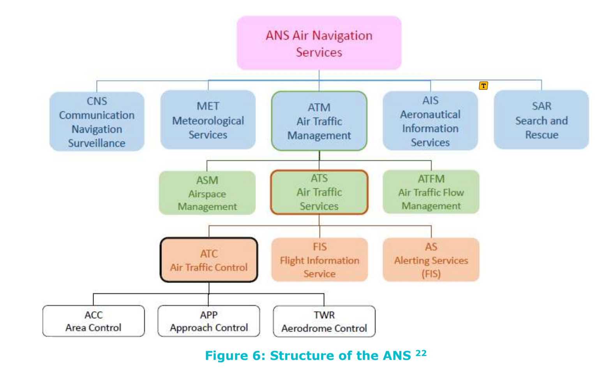

# Journal — 2026-09-24

## 20:02 — Welcome

**Recap:**
- Interim Report #1 submitted; SOI ratified (D-007) and reconciled into the BDD (D-008). Interim #2 due Oct 25.
- The context-diagram connection block *is* in `nas_context_diagram.sysml` (ops-relevant `connect` statements; uncommitted edits so far are only comment refinements). Not yet checked against the model.
- Loose ends: Information Services / Decision Support placement (D-008 vs. D-007), Flight Crew role split, Seamster crosswalk actor questions, placeholder scenario procedures. Stakeholder view (§10) still slipped since 09-07.

**Focus picks (Professor):**
1. Validate the connection block against the BDD and justify each connection in one line — it exists but is unverified, and unjustified links are indefensible in review.
2. Resolve Info Services / Decision Support placement — D-008 contradicts D-007 and it decides where `VehicleDynamicsModel` sits for §12-13.
3. Reconcile the stakeholder/actor view to D-007 — the other slipped §10 item; shares the Flight Crew split with pick 2.

## Manual Notes

### Reviewing GREAT_D2.1_Concept_VF - Good Content.pdf

Could I model the different ATC intervention mechanisms and see how they'll impact things:
Flow management measures: The flow regulator measures that aims to prevent the overload of air traffic network in China are as follows:
 Ground delay program (GDP)  Airspace Flow Program (AFP)  Miles-in-trail (MIT)
 Coordinative rerouting  Fix Balancing
 Altitude restriction  Airborne Holding program  Ground Stop program
 Interaction between "ground delay" flow management programs.

Refer to table 14:
KPA Performance requirements
Safety performance
GA 875154 GreAT
Safety performance measurement should be evidence-based and should be standardized (same indicators, models, assumptions). The same high level of safety shall always be maintained, including during any transition phases from one system design to another one; involving prepared contingency plans. Collision avoidance systems shall serve as a backup
Security
Access and Equity
safety net. Safety risks shall be communicated in the ATM community.
The sovereignty of the states shall not be compromised, and the security level shall comply with a coordinated minimum. Security management principles shall involve collaborative decision making.
The ATM system shall support all aircraft types and all missions, including manned and unmanned flights; and it shall enable even highly diverse traffic with lowest possible restrictions.
Cost Efficiency The implementation of improvements shall be assessed in a
cost-benefit-analysis for ensuring Cost Efficiency.
Capacity
Global Interoperability
The ATM Capacity shall always be sufficient, according to agreed levels, and shall be provided in a cost-efficient and resilient way. As far as possible, provided capacity shall be fully used as much as possible.
The ATM system shall in any case consider environmental issues, shall set up and monitor the achievement of environmental performance targets, and shall use a collaborative decision-making process to find the best balance between environmental and economic interests.
Predictability Predictability shall be ensured by a comprehensive information
exchange between ATM community members.
Environmental
Flexibility
Single-flight
efficiency
The ATM system shall provide maximum Flexibility to all airspace users, allowing them to operate wherever, whenever and whatever they desire on short notice to exploit operational opportunities.
The so-called single-flight efficiency shall be maximized by the ATM system for all flights at the same time.
Global Interoperability shall be achieved by international standardization.

And TAble 16:
R (SES high level goals) CAAMS
Operational
efficiency
Ambition (2035) compared to baseline (2012)
Enable 3-fold increase in ATM capacity compared to 2012
 Reduction of ANS
costs per flight by
30-40 %  Reduced ATM
services unit costs by
50% or more
 Reduction of 250500 kg in Gate-togate fuel burn per flight 53
 Reduction in
additional gate-togate flight time of 50-55 % 54
Enable 10% reduction in the effects that flights have on the environment
KPA
Capacity
Management
Service
Ambition (2035) compared to baseline (2015)
Enable 3-fold increase in ATM capacity compared to 2015
 Reduce cost of ATS
per flight by 20%
 Raise the rate of
medium and small
equipment produced locally over 80% and the rate of large equipment up to 50%
Efficiency Average delay due to ATC
is less than 5 minutes
Reduce the carbon emission of flight operation by 10%
53 The fuel efficiency performance ambition addresses the average gate-to-gate fuel consumption per flight
54 From an ECAC-wide, the average value of 8.2 minutes for an average flight in 2012
Safety Improve safety by factor
of 10 Safety
Security
No significant disruption due to cyber-security vulnerabilities
 reduce the rate of
incidents due to ATC
by 90%  reduce the error rate
due to ATC by 20%
∅ No KPA or KPI is specified
for security

ANNEX A – SUMMARY OF THE
CONCEPT ELEMENTS AND THEIR
POTENTIAL ENVIRONMENTAL IMPACT
This annex gathers all the concept elements described in chapter 4.4 Greener Air Traffic Concept Elements mapped with the best-case scenario. It shows also their potential impact on the environment and on the other KPIs.
Related Best-Case situation Environment Impact Evaluation 60
Type of operation Concept Elements
Ground Operations
Impact on the
other KPAs
 Aerodrome
Capacity
4.1.1 A and B Low (medium)
Ground operation
 EL 1: On-board system supporting
4D taxi execution
 EL 2: advanced integrated planning
and scheduling tools
 EL 3: ‘tow-in’ maneuver
4.1.1D Low (High)
Continuous
taxi
operations
Adapted pre/post-flight
activities
Propulsion during taxi
GA 875154 GreAT
 EL 4: Use parallel runways (almost)
in segregated mode and place the
parking areas in the nearest  EL 5: intersection take-off  EL 6: Late touchdown
 EL 7: Adapt procedure for the Pre/Post-Flight Activities
 EL 8: Consider this procedure for
future aircraft designs and
operation manuals  EL 9: Consider the needed time for
these activities in the planning tools
 EL 10: Individual engine start-up  EL 11: Use of alternative propulsion
techniques (out of scope of Great)  EL 12: Use of external power supply
(out of scope of Great)
 Capacity  environment
(noise)
 Capacity
4.1.1A Low (medium)
 Capacity  ATC capacity
4.1.1E Low (High)
60 The evaluation of the potential to reduce fuel is provided for the whole flight (except when the format Impact 1 (impact 2) is used; where impact 1 is the potential to reduce fuel burn for the whole flight and impact 2 only for the related phase)
Security: PUBLIC 1

No thrust
reverse
during landing roll
Free Route in
TMA
Continuous
Descent
operations
Latency tolerant delay
absorption
Infinitely variable and low emission
delay
absorption
Late-MergingPrinciple for
arrivals
GA 875154 GreAT
D2.1 Current TBO Concepts and Derivation of the Green Air Traffic Management Concepts – V1.00
Consideration
of natural
phenomena
For Taxi
Movements
 EL 13: update future aircraft
designs and operation manuals
 EL 14: Consider these restrictions in
the planning tools
 EL 15: Reduce drag of the airplane
in headwind situations
 EL 16: Increase drag of the airplane
in tailwind situations
 EL 17: articular configuration
depending on the topography and landform
 EL 18: avoid reverse thrust  EL 19: use idle reverse
 EL 20: integrate EL 18 and EL 20 in
the future aircraft design
TMA Operations
 Capacity
4.1.1C Low (High)
4.1.2D and 4.1.4A/B High
 EL 21: avoid assign separate routes
for arrivals and departures
 EL 22: reduce overfly and detours  EL 23: use automated planning
tools
 EL 24: use 4D TBO around airport  EL 25: use coordination supporting
systems
 Airspace
capacity
 ATC capacity  Environment
4.1.4B High
 EL 26: use strategical measures to
support CDA
 EL 27: use tactical measures to
ease separation provision
 EL 28: use coordination support
tools to easily coordinate CDOs across different sectors
 EL 29: Use TBO in the TMA
 No impact
 TMA /
aerodrome capacity
 Flexibility
4.1.4A Medium
 EL 30: early sequencing  EL 31: use TTO instead of delay
absorption
 EL 32: delay absorption procedure
optimization
 EL 33: alternate and more reliable
communication method
 EL 34: more flexible path stretching  EL 35: delay absorption with lowemissions flight parameters
(altitude, speed)  EL 36: more precise delay
absorption
 EL 37: controller assistance tools  EL 38: TBO in the TMA
 ATC capacity
4.1.4A low to medium
Medium to high
 EL 39: backup mechanism for less
equipped aircrafts
 Equity  Capacity
Security: PUBLIC 187

D2.1 Current TBO Concepts and Derivation of the Green Air Traffic Management Concepts – V1.00
 EL 40: automatic air-ground
negotiation of the trajectory before entering the TMA
4.1.2E High
Continuous
Climb
Operations
 EL 41: Solve separation conflicts
with heading changes
 EL 42: Consider the optimum climb
profile
 EL 43: use automated planning
tools
 ATC capacity
4.1.2C,D, E and F
low to medium
Early Spreading of
Departures
 EL 44: Consider the lateral and
vertical departure trajectory for the sequencing of departures
 Access and
equity
4.1.2D/E and 4.1.4A
Medium
Highest freedom of movement
with shortest
airspace
borders
Avoidance of Speed Control
 EL 45: airspace design with more
freedom of movement
 Access/
equity
 airspace
capacity
4.1.4C and 4.1.5B medium to high
Flexible Final approach legs
 EL 46: assist the ATCO to integrate
the speed profile
 EL 47: use planning tools that
consider the speed profile
 EL 48: TBO during the last portion
of the flight
 ATC capacity
4.1.5A medium to high
Free Route during Cruise
flight
 EL 49: shorten the final leg through
flexible RNP approaches
 EL 50: implementing additional
obstacle clearance areas
 EL 51: 4D-trajectories for the last
miles to be flown
En-route Operations
 ATC capacity
4.1.3C High
Standardized Cross-Border
ATM
 EL 52: avoid prescribing fix routes  EL 53: FRA and a more flexible
tactical handling of aircraft routes by ATC
 EL 54: Use coordination support
tools / cross-sector planning tools for larger FRA implementation  EL 55: TBO applied locally in the
airspace
 ATC capacity
4.1.3C Medium
GA 875154 GreAT
 EL 56: Share the responsibility of
service provision
 EL 57: Ease coordination between
two different ANSPs and make their systems compatible with each other  EL 58: Standardize ATC fees  EL 59: Establish multi-national
service providers
 Cost
efficiency

D2.1 Current TBO Concepts and Derivation of the Green Air Traffic Management Concepts – V1.00
In-Flight Trajectory Optimization
4.1.3C Medium (long-haul) / low (short-haul)
Free Vertical
Movement
 EL 60: enhanced connectivity
between airspace users and service providers
 EL 61: share real time position/
conditions with other airspace users  EL 62: possible re-plan and re-file
of the flight in-flight
 EL 63: enable the ASNP to
prioritize, accept or deny requested route updates
 EL 64: Balance the update interval
with the degree of flexibility
 Predictability
4.1.3 Low (around 1.5%)
Free cruise
Speed
 EL 65: Allocate narrow level bands
instead
 EL 66: Use conflict detection tools
using these level bands
 EL 67: Apply and establish vertical
separation on a tactical basis only when needed
 Capacity
4.1.3A Low (around 2.4%)
GA 875154 GreAT
 EL 68: Avoid speed restrictions at
all
 EL 69: Prefer lateral / vertical
separation instead of using speed control
 EL 70: Clear the aircraft for a lower
and an upper speed limit if
restrictions are unavoidable
 Predictability

I ran the approved reads: A-CDM §§1–5.1.15 and roles, GreAT D2.2 (text plus the Figure 3 node diagram), JO 7110.65BB ¶3-7-2 and the glossary, the Seamster OOOI rows, and the NAS infrastructure roadmaps. I haven't edited any repo file. I did put temporary text extractions in the scratchpad, outside the repo.

Your questions
Environment: link it, but not with the same kind of connect.

Your connects are operational information exchanges between modeled systems. Environment influences are different: they are one-way, exogenous and often dynamic. I'd draw them as a separate kind of directed flow so you can tell them apart on the diagram.
Three kinds seem worth separating: rules (Governance, static), disturbances (weather, demand, military and special-use airspace, dynamic scenario inputs), and feedback (incident reports, delay and passenger response).
Link only where an influence changes a decision. Wiring the environment to every part clutters the diagram.
Practical catch: Environment is currently one undecomposed part (D-008). To say which influence goes where, you would need sub-parts (governance, weather, demand, and so on) or typed flows.
GreAT models Weather and Aviation Information Management as nodes with needlines to ATFM, the airline and the aircraft. You are treating weather as environment, which is a defensible difference.
TFM: it's not tactical in the ATC sense.

TFM is the hours-scale layer above ATC. It is called tactical only relative to schedule planning. The European system is literally named the "Enhanced Tactical Flow Management System" (A-CDM p.9).
Your own 09-20 notes tier it as national/strategic → regional flow → sector/tower tactical.
In A-CDM the horizon runs from the flight plan at EOBT−3 h and CTOT issue at EOBT−2 h (pp.17–19) down to per-flight updates.
That supports pointing the AOC ↔ ATC link at TFM (atfms/atcscc) via the ATC coordinator, not the tactical atc part.
For your future internal routing, I'd put ports on the AirspaceManagement domain boundary and bind them inward. You can then refine internally without rewiring the context diagram. That's SysML v2 idiom from my own knowledge, not a workspace source.
OOOI: automatic when the aircraft is equipped, and I got this wrong before.

Seamster rows E-3#10, E-5#06 and E-13#12 are "Send Off The Gate / Off The Ground / Into The Gate report (automated)", sent from the avionics ("FD · ACARS") to the dispatcher, marked "If equipped". My earlier note listed them as crew reports, and that was wrong.
The sensors behind the triggers (door, brake, weight-on-wheels) are my general knowledge.
A-CDM shows the ground-side alternative: off-block can be detected by A-SMGCS or docking guidance or keyed in by airport ops (p.36). Take-off comes from tower systems, radar or ACARS (p.37). "Aircraft Ready" is reported by the crew and recorded by the controller (p.32).
So it depends on equipage and local setup. This is evidence for an aircraft → AOC link that doesn't go through the crew, which the diagram lacks.
Related: weight and balance normally goes by ACARS, with a face-to-face print from the load planner only "if not by ACARS" (E-2#20). The FAA roadmap lists ACARS "Weight & Balance" and "PDC & D-ATIS" services.
Merging PIC, Captain and FO: fine. It loses the pilot-flying/pilot-monitoring authority distinction, consistent with the earlier abstraction. It should be logged with its reason so you can defend it.

ILS: use association, not ownership.

The roadmaps show ILS as an FAA NAS asset (project N03.01-00, ILS CAT I and CAT II/III), but also say non-federal navaids exist at some airports.
In SysML v2, part means contained and owned, while ref part means associated. So Airport could hold ref part navaids pointing to navigation-aid parts that live in Infrastructure. Each would carry a maintainer attribute (FAA, airport or other), and the signal flow would run navaid → aircraft.
The same pattern would fit controlTower: a physical facility at the airport, with controllers who are ATC.
Taxi/apron: I found sources, and the boundary is movement area versus nonmovement area, not taxi versus takeoff.

JO 7110.65BB defines nonmovement areas as "taxiways and apron (ramp) areas not under the control of air traffic." ¶3-7-2 says their movement is the responsibility of the pilot, the operator or airport management. At towered airports, entry onto the movement area needs ATC approval.
ATC ground control issues taxi routes on the movement area (¶3-7-2), so "taxi is airport-driven" holds only on the ramp and non-movement taxiways.
A-CDM §4.3 (p.11) puts clearance delivery, ground movement control and runway control with ATC. It says apron control is ATC "in some cases" and the Airport Operator in others.
GreAT has the Tower Control Center issue pushback, taxi-out and takeoff clearances, with the Airport as a separate node.
So your rule holds for the apron. I'd adjust it to: apron/ramp is airport-driven, and the movement area (taxiways, runways, airborne) is ATC.
A-CDM: what it says about AOC ↔ Airport
Partners: Airport Operator, ATC, Aircraft Operator, Ground Handling and Network Manager, with Met, Stand and Gate Planning as supporting roles (pp.11–13).
Ownership: the Aircraft Operator owns the flight plan and the TOBT (target off-block time). It can delegate the TOBT to the ground handler.
Times are computed, not negotiated: landing time comes from Network Manager estimates. The chain is TOBT → the pre-departure sequencer (with ATC) issues TSAT (target start-up approval time) → TTOT (target take-off time), where TTOT = TOBT + estimated taxi-out time (p.20). The one real negotiation is the airport slot at fully coordinated airports, which is a long-horizon, scheduling-level exchange.
Milestone events: ATC flight plan activated, boarding started, aircraft ready, start-up requested and approved, off-block, take-off. Each has a defined trigger, an owner and alert rules.
Your other items: passenger counts, catering, fuel and baggage are not A-CDM exchange objects. They are handling requirements between the airline and ground handlers or suppliers. That matches your instinct that they are "maybe others", but they need a different source.
Caveats: it's a European spec, so it's a pattern and not a US standard. I haven't read the alerts, requirements or annexes.
GreAT D2.2: what it adds
Figure 3 (p.29) is an IBD of 10 nodes with numbered ports and needlines. The nodes are Airport, Airline Operations Center, ATFM Center, Aviation Information Management, Weather Service, ARTCC, Area Control, Approach Control, Tower Control and Aircraft. It has no separate flight-crew node, which supports your merge.
Airport is separate from Tower Control, matching A-CDM's separation of airport operator from ATC.
Pre-departure loop (Table 3, pp.43–44): AOC submits an initial trajectory to ATFM, and ATFM returns airspace status and constraints. AOC submits a TOBT to the Airport, which allocates the departure slot and taxi route. Tower, ATFM, Airport, Area and Approach then negotiate the departure trajectory. The column layout is garbled in extraction, so the assignment of rows to nodes is inferred.
Airline system interfaces (§5.4.17–19): it receives airspace status, TFM strategies and weather. It sends the flight plan and route application, and receives the confirmed new track.
Caveats: it's a 2021 EU–China future-concept (TBO) architecture. The Tower state machine is unreadable at this resolution. I did not read §5.2 or the cruise-to-taxi-in event traces.
Proposed next actions
None taken. Which do you want?

Update the exchange-evidence note: correct the OOOI attribution, add the A-CDM information-object table and the GreAT node summary, replace the apron section with the movement/nonmovement evidence, and record the crew merge, the navaid ref part idea and the environment-flow kinds.
Finish reading: A-CDM alerts, requirements and annexes, plus GreAT §5.2 and the remaining event traces.
Annotate both sources into evidence/literature-notes/annotations/ per the annotate-source workflow.
Draft decision-log entries for you to accept or reject: crew merge, the movement/nonmovement boundary, and navaid association.
.sysml edits: I'd hold these until you've decided the above.