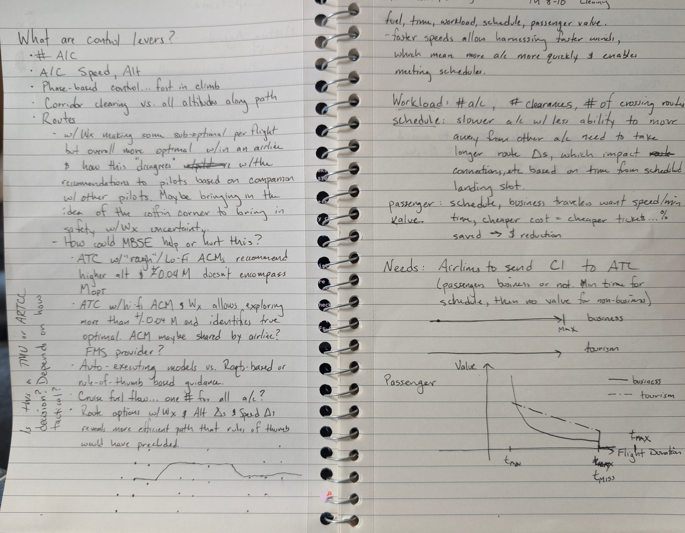

# Journal — 2026-10-04

## 12:25 — Welcome

**Recap:**
- Interim Report #2 is due 10-25, three weeks out. The 10-02 commit message set the direction: start from Report #2 and work out the next best steps. The 10-02 journal holds an advisor-meeting agenda (scope option a/b/c, current-state metric, working agreement) but no outcome, so it's unclear whether the meeting happened.
- Model state: the context diagram is built but its §10 box is still unchecked. The activity diagram is scaffolded only (ECD 10-01 passed). Swimlanes (09-10), sequence diagrams (09-22), and the RACCI items (09-10) are overdue. The traceability chain (ECD 10-12) is not started.
- Housekeeping: no sign-off since 09-26, so `task-board.md` is stale. The 10-02 journal additions are uncommitted. Two new PDFs in `evidence/sources/` (FAA JO 7110.10EE and the AIM) are not yet registered.

**Focus picks (Professor):**
1. Work backward from Interim Report #2: list what Assumptions and Methodology and preliminary Results each need, and which model artifact supplies it. Both sections depend on the scope option (a/b/c) and the current-state metric, which are still open and are the adviser's call. Record the meeting outcome, or get the meeting on the calendar.
2. Finish the nominal-flight activity diagram with swimlanes, reconciled against `conops-nominal-domestic_flight.md`, and check the context diagram box. It is the most direct source of a preliminary result for Report #2 and it clears two overdue items in one pass.
3. Run a sign-off at the end of the session to re-sync `task-board.md`, re-date the slipped ECDs against 10-25, and register the two new PDFs (they address the flight-crew-side literature gap).

## 12:32 — References sweep and highlight extraction

Two new files in `evidence/sources/` were processed (bib entry, summary, ledger row) and their PDF highlights merged into the summaries. Ratings: one 5, one 3.

- [faa2025aim](../../../evidence/literature-notes/summaries/5%20-%20faa2025aim.md) (AIM, Basic + CHG 1–3), **rated 5.** The pilot-side companion to JO 7110.65BB. About 100 highlights merged, covering Ch. 4 and §5-1 to §5-3. Section 5-5 (pilot/controller responsibilities, side by side for 15 procedures) was read in full; it is close to a ready-made responsibility matrix for the pilot ↔ controller pair and says the two "intentionally overlap."
- [faa2025jo711010ee](../../../evidence/literature-notes/summaries/3%20-%20faa2025jo711010ee.md) (JO 7110.10EE, Flight Services, Basic only), **rated 3.** Flight service is mostly outside the Part 121 scope. Useful for flight plan content (Appendix A) and what reaches the ARTCC (§6-2). Five highlights merged, all Appendix A headings.

Things to act on:
- The AIM is guidance, not regulation. Authority claims (PIC final authority, dispatcher joint authority) still need 14 CFR 91/121, which is not registered.
- AIM ¶5-2-2: the PDC departure clearance goes tower → airline/service provider computers → aircraft by ACARS. Check this against the tower, AOC, and flight-deck links in the context diagram.
- Seventeen sections are marked in the AIM contents but have no body highlights yet (arrivals, position reporting, Section 5-5, weather). They are listed in the summary as the remaining reading list.
- `FAA Order 5190.6C Airport Compliance Manual Chapter 12.pdf` is in `evidence/sources/` with no ledger row. Owner to decide: register or remove.

`open-questions.md` "Literature gaps" and the §3–§4 annotation table in `source-register.md` are updated. The two `inbox/` extraction files were deleted after merging.

## Handwritten Notes

### Transcription (left page)

**What are control levers?**
- Number of aircraft
- Aircraft speed, altitude
- Phase-based control... fast in climb
- Corridor clearing vs. all altitudes along path
- Routes
  - With weather making some flights sub-optimal individually but more optimal overall within an airline, and how this "disagrees" with the recommendations to pilots based on comparison with other pilots. Maybe bring in the coffin corner to bring in safety with weather uncertainty.
  - How could MBSE help or hurt this?
    - ATC with "rough"/lo-fi aircraft models (ACMs) recommends a higher altitude, and ±0.04 M doesn't encompass M_opt.
    - ATC with a hi-fi ACM and weather can explore more than ±0.04 M and identifies the true optimum. ACM maybe shared by the airline? The FMS provider?
    - Auto-executing models vs. requirements-based or rule-of-thumb-based guidance.
    - Cruise fuel flow... one number for all aircraft?
    - Route options with weather, altitude changes, and speed changes reveal a more efficient path that rules of thumb would have precluded.

Margin: Is this a TMU or ARTCC decision? Depends on how tactical?

Sketch: a vertical profile with a step up to a higher level and a later step down.

### Transcription (right page)

Objectives: fuel, time, workload, schedule, passenger value. (The line above this is cut off in the photo.)
- Faster speeds allow harnessing faster winds, which means more aircraft more quickly and enables meeting schedules.

**Workload:** number of aircraft, number of clearances, number of crossing routes.

**Schedule:** slower aircraft with less ability to move away from other aircraft need to take longer route changes, which impact connections etc., based on time from the scheduled landing slot.

**Passenger value:** schedule; business travelers want speed/minimum time; cheaper cost = cheaper tickets... % saved → $ reduction.

**Needs:** airlines to send CI to ATC (passengers business or not; minimum time for schedule, then no value for non-business).

Sketch: passenger value vs. flight duration. The business curve (solid) falls steeply from t_min and flattens. The tourism curve (dash-dot) declines gently and linearly. Both drop to zero at t_max / t_miss.

### Experiment definition: questions still open (from the 10-04 review)

1. What single thing differs between baseline and treatment: information available to ATC, the lever set, or the decision procedure? As drafted, all three change at once.
2. Where is MBSE in the treatment? The simulation compares two operational architectures; it cannot test "requirements-only vs. MBSE" as engineering methods.
3. Sources for ±0.04 M and ±0.072 M. A +0.072 M change exceeds MMO from typical cruise Mach.
4. Baseline realism: en-route controllers do assign altitudes and vectors, and the pilot can answer "unable." Removing these makes the baseline a straw man.
5. Sector-level tactical decision or TMU? This fixes which block owns the capability.
6. What is the "truth" model that both the baseline and the treatment decisions are scored against?
7. Expected effect size: is the fuel/time difference larger than the model uncertainty?
8. Does this scenario replace `conops-hub-to-hub-trajectory-cost.md` or sit inside it?

## 12:45 — 5190.6C Ch. 12 registered; AIM second pass

**5190.6C Chapter 12** is now registered as [faa2026order51906cCh12](../../../evidence/literature-notes/summaries/2%20-%20faa2026order51906cCh12.md), **rated 2.** Read in full. One usable principle: the airport sponsor can delegate operation to a tenant but keeps "the ultimate responsibility for the management and operation of the airport" (12.6a). It does not mention gates, terminals, or air carriers. Its URL was not recorded. The ledger is now 66 of 66.

**AIM second pass.** The 14 sections marked in the contents without highlights were read in full and checked against the existing notes. Results are in the "Second pass" section of the [AIM summary](../../../evidence/literature-notes/summaries/5%20-%20faa2025aim.md). New and directly useful:

1. ¶5-4-26: towers sequence landings "first-come, first-served." A candidate current-state allocation rule for the §11 study.
2. ¶5-4-2: fuel conservation is a stated aim of an ATC program; fuel-efficient descent is 250–350 ft/NM. An airline/ATC alignment for the objective ontology, and a simulation parameter.
3. ¶5-4-1: "descend via" gives the crew discretion over the vertical profile; a vector cancels the STAR and its restrictions. An authority transition for the RACCI.
4. ¶5-4-6: the form of the clearance decides what the crew loads in the FMS. FAA text to cite for link 6, now graded [SME].
5. ¶5-3-2: position reports stop under radar contact. The link 4 exchange list should say so.

Supporting: approach control as a function an ARTCC can provide (¶5-4-3), the PIREP path to the NWS (¶7-1-18), TCAS RA responsibility transfer (¶4-4-16). Nothing useful in side-step, preflight briefing, or pre-taxi beyond one timing number.

No grades or `.sysml` were changed. The candidates are listed under "Sources not yet mined" in `context-diagram-exchange-evidence.md` for the owner to accept or reject.

## 14:20 — Experiment definition discussion

Worked from the handwritten notes above toward a specific definition of the experiment to simulate. The starting idea was a baseline "without MBSE" against a treatment "with MBSE," using about four aircraft in one ATC region (two or three in trail, one crossing).

### What changed in the framing

- **The simulation cannot test MBSE as a method.** It compares two operational architectures. The defensible claim is that the model identifies and traces a missing exchange (weight, cost index, performance model from airline/FMS to ATC), and the simulation shows what that exchange is worth.
- **The first draft changed three things at once:** the information ATC has, the levers it can use, and the decision procedure. Any improvement could not be attributed.
- **The baseline was at risk of being a straw man.** En-route controllers assign altitudes and vectors routinely, and the pilot can answer "unable" or make a request. Withholding those makes the baseline artificially bad.
- **"More information gives better decisions" is close to a tautology.** The motivating question is that sub-system optimal is not system optimal, so the scenario has to include a case where the system's best outcome makes one aircraft worse off.

### Where the design landed

- **Baseline:** a competent sector controller with every real lever (altitude, vector or offset, speed), optimizing for safety and workload, with no airline cost data. For a crossing conflict the baseline answer is one descent clearance. It needs no calculation, no knowledge of aircraft state, and vertical separation is robust to along-track uncertainty.
- **The baseline's limit is its objective and its data, not how the system was engineered.** ATC already has trajectory-prediction automation; it does not have weight or cost index.
- **Three cases, levers held fixed:**
  - A: rule-based decision with today's information.
  - B: automated decision with a nominal aircraft model.
  - C: automated decision with shared weight, cost index and a higher-fidelity model.
  - B against A is the value of automation. C against B is the value of the information exchange, which is the architecture claim.
- **One "truth" model** scores every case, at higher fidelity than the model any case used to decide.
- **Enumeration, not a solver:** four aircraft times a handful of discrete maneuvers. This keeps the work near scope option (b).
- **Three metrics:** airline cost (fuel plus time weighted by cost index), a workload proxy (number of clearances), and separation as a hard constraint. Cost index already carries the airline's value of time, so the passenger value curve stays qualitative.
- **Score each resolution from four levels:** aircraft, airline, sector, system. The result is one table of resolution options against stakeholder outcomes in which the preferred option changes with the level. This answers D-004 directly.
- **Scenario ingredients:** two flights from the same airline (one late with connections, one early), a spread of weights, and a reported "who pays" figure such as the largest penalty taken by any one aircraft.
- **Three possible results** when the informed decision is compared with "descend this aircraft":
  1. Same answer: the information is worth nothing here. Include a case like this (similar weights and cost indexes) to show the comparison is not rigged.
  2. Descend the other aircraft: same workload, lower cost. The strongest result, because nothing is traded away.
  3. A different maneuver: lower cost but more workload or uncertainty.

### Details still to settle in the baseline

- Which aircraft descends. The rule does not choose between the two, and the tie-breaker needs a source.
- What happens after the descent: a second clearance to climb back (two clearances, not one) or a fuel penalty for the rest of the cruise.
- The in-trail aircraft have to make the level below matter, or they do no work in the scenario.

### Facts surfaced

- **EDST** is a function of ERAM used by the en-route sector team, with planning at the Radar Associate (D-side) position (JO 7110.65BB ¶2-10-1, ¶13-1-1). It derives trajectories from the current plan, forecast winds, aircraft performance characteristics and track data, and predicts conflicts. Trial planning tests a clearance before it is issued (¶13-1-3).
- **Responsibility:** the automation predicts; the sector team scans, evaluates and acts "as early as practical" (¶13-1-2). Separation stays with the controller.
- **This is a sector-level tactical decision,** not a TMU one, which answers the margin question in the notes.
- **ATC does not receive weight or speed intent.** They "are considered competitive parameters by airlines and are not available for use" (`schultz2012adaptiveClimb`, p. 2). The ground predictor starts from a nominal weight and can only infer the real one from track data.
- **Weight can be estimated in cruise** from the altitude the aircraft chooses (`mori2022massCruise`): about 1,000 ft of cost-optimal altitude per 20,000 lb for a B787-8, to about 3 percent mean error on 39 flights. Aircraft sit below their optimum because of 1,000 ft level spacing, traffic or turbulence, and infrequent level changes. The method fails when an aircraft is held low for the whole cruise.
- **Cost function in cost-index form:** J = (CI + fuel flow) / ground speed, per unit distance (`mori2022massCruise`, Eq. 1–3).
- **Speed tolerances** (AIM): crews report a true airspeed change of 5 percent or 10 kt, and hold an assigned speed within ±10 kt or 0.02 Mach. An unreported 10 kt over 20 minutes is about 3.3 NM along track, against 5 NM separation. A speed resolution is therefore the lever most sensitive to prediction error.
- **False alerts grow with look-ahead time** and depend heavily on intent information; speed intent is generally not in the flight plan (`bilimoria2004stateVectorProbe`). That study is of a velocity-vector probe, so its rates are not EDST's. Field reports from URET's first two centers suggested false alerts were not a main controller concern.
- **+0.072 Mach exceeds MMO** from a typical cruise Mach, so that lever is only available in the slow direction.

### Still unsourced

- The ±0.04 M and ±0.072 M figures. If they are from experience, grade them [SME].
- A measured false alert rate for EDST or URET.
- The 20-minute look-ahead for the conflict probe.
- That the ground aircraft model is type-based. The evidence is indirect (the nominal-weight starting point in `schultz2012adaptiveClimb`).

### Open questions

- Is the expected fuel and time difference larger than the model uncertainty? Do a back-of-envelope before building.
- If ATC favors high cost-index flights, what stops airlines from inflating it?
- Does this scenario replace `conops-hub-to-hub-trajectory-cost.md` or sit inside it?
- Scope option (a), (b) or (c) is still the adviser's call.

### Sources registered

Three sources added for this work (bib entry, summary, ledger row); the ledger is now 69 of 69.

- [schultz2012adaptiveClimb](../../../evidence/literature-notes/summaries/4%20-%20schultz2012adaptiveClimb.md), **rated 4.** Climb only, simulation only.
- [mori2022massCruise](../../../evidence/literature-notes/summaries/4%20-%20mori2022massCruise.md), **rated 4.** One type, oceanic, small sample.
- [bilimoria2004stateVectorProbe](../../../evidence/literature-notes/summaries/3%20-%20bilimoria2004stateVectorProbe.md), **rated 3.**

## 15:00 — Prior work overlapping the experiment

Searched for work that already explores the experiment's questions. Almost every piece has prior work. These are leads from search summaries; none has been read or registered yet.

| Experiment question | Who has explored it | Overlap |
|---|---|---|
| What is it worth for ATC to know weight, speed intent and aircraft performance? | Coppenbarger (NASA, 1999 and 2001): airline flight-planning data and a real-time data link of aircraft parameters into CTAS. SESAR ADS-C EPP (ADSCENSIO, 4DSkyways, PJ18): aircraft downlink their FMS-predicted profile, including speed schedule, to ground tools. | Direct. This is case C. The SESAR validation paired the downlink with a resolution tool that minimises controller workload and fuel burn. |
| What does a controller do by default in a conflict? | Rantanen and Wickens: 256 resolution cases from five US centers. Kirwan and Flynn (EUROCONTROL CORA 2): controller resolution strategies. | Direct. Vertical maneuvers were used most, then lateral, then speed, and descents were twice as frequent as climbs. The source the baseline's preference order needs. |
| Can small speed changes resolve conflicts without burdening the controller? | ERASMUS (European Commission, 2006) and the follow-on "subliminal speed control" papers (Transportation Science 2016; Transportation Research Part C 2010). | Direct. Speed changes small enough to sit inside ATC's prediction uncertainty. Check their speed range against ±0.04 M. |
| Can an automated resolver pick which aircraft moves and how? | Erzberger's Autoresolver in NASA's Advanced Airspace Concept: resolutions 2 to 20 minutes ahead using path, altitude and speed, with single-aircraft or cooperative maneuvers. | Direct for the mechanism of cases B and C. How it ranks resolutions by cost is not confirmed. |
| Who pays when the system-best resolution hurts one aircraft? | Equity-oriented conflict resolution (TU Dresden), a Glasgow thesis on fairness and equity in trajectory-based ATM, and a Transportation Science 2014 paper. | Direct for the "who pays" figure. One notes that little has been done to quantify what resolution strategies cost in direct operating cost. |
| Will airlines game a system that uses their cost index? | SESAR UDPP (user-driven prioritisation) and mechanism-design papers on collaborative flow management. | Partial: flow-management level, not sector conflicts. Airlines can use simple non-truthful strategies; mechanisms may work better without detailed cost reporting. |
| Can the airline side find a better route or level that ATC will accept? | NASA TASAR with Alaska Airlines: cockpit software proposing traffic-compatible route and altitude changes; estimated 8,000 to 12,000 gallons saved per aircraft per year. | Partial: the mirror image. It gives the aircraft a traffic picture; the experiment gives ATC the aircraft's costs. |

Already registered and overlapping at the concept level: `great2020d21tboConcept`, `icao2005doc9854`, `sesarju2025masterPlan`.

What this means:
- **The value-of-information question is not new.** Coppenbarger and the EPP work answered it for trajectory prediction accuracy. Cite them as the basis for case C.
- **The baseline is now sourceable.** Rantanen and Wickens give an empirical preference order that agrees with the "one descent" baseline.
- **What looks less covered:** scoring one conflict from the aircraft, airline, sector and system levels in one table, traced back to an architecture model. This is a judgment from a search, not a literature review; the equity papers are the most likely to contradict it.
- **The gaming question has a known answer** in a neighbouring problem, which makes it a well-founded limitation to state.

Read first: Rantanen and Wickens, Coppenbarger 2001, and the equity-oriented conflict resolution paper.

Links:
- [Rantanen and Wickens: Why do controllers choose the conflict resolution maneuvers that they do?](https://ir.lib.ugm.ac.id/id/eprint/9234)
- [Rantanen, ISAP 2009 paper](https://corescholar.libraries.wright.edu/isap_2009/83)
- [Subliminal Speed Control in ATM (Transportation Science)](https://pubsonline.informs.org/doi/fpi/10.1287/trsc.2015.0602)
- [A simulation based study of subliminal control for ATM (TR Part C)](https://dx.doi.org/10.1016/j.trc.2010.03.002)
- [Erzberger: Advanced Airspace Concept, ICAS 2006](https://icas.org/icas_archive/ICAS2006/PAPERS/083.PDF)
- [Erzberger: resolving short-range conflicts, ICAS 2008](https://icas.org/ICAS_ARCHIVE/ICAS2008/PAPERS/383.PDF)
- [SESAR enabler: conflict tools using enhanced trajectory prediction](https://atmmasterplan.eu/system-enablers/2484320)
- [SESAR PJ18 W2 53B solution](https://www.sesarju.eu/sites/default/files/documents/solution/Sol%20Pj18%20W2%2053B%20CN%20V3.pdf)
- [NATS: Initial Trajectory Sharing (DIGITS)](https://i.nats.aero/rc21/?p=1215)
- [Equity-oriented aircraft collision avoidance model (TU Dresden)](https://fis.tu-dresden.de/portal/en/publications/equityoriented-aircraft-collision-avoidance-model(c5f258d9-09e1-4041-bda9-0db51005bfb7).html)
- [Assessment of fairness and equity in trajectory based ATM (Glasgow thesis)](https://theses.gla.ac.uk/3237)
- [Transportation Science 2014, v48 n3 pp. 334-350](https://ideas.repec.org/a/inm/ortrsc/v48y2014i3p334-350.html)
- [EUROCONTROL: UDPP simulation](https://www.eurocontrol.int/news/recent-udpp-simulation-helps-airlines-lower-cost-delay-40-capacity-constrained-situations)
- [Impact of cost approximation on collaborative regulation resolution (Westminster)](https://westminsterresearch.westminster.ac.uk/item/w5w17/impact-of-cost-approximation-on-the-efficiency-of-collaborative-regulation-resolution-mechanisms)
- [NASA TASAR benefits report](https://ntrs.nasa.gov/api/citations/20140012787/downloads/20140012787.pdf)

## 16:30 — Prior-work papers downloaded and read

Twenty of the overlapping papers were downloaded to `evidence/prior-work-experiment-definition/` and written up in [prior-work-writeup.md](../../../evidence/prior-work-experiment-definition/prior-work-writeup.md). They are not registered sources: no bib entries, no ledger rows, no ratings. The write-up gives, for each paper, the decisions and their rationale, methodology, control levers, results, and what it means for the experiment. It ends with a cross-paper summary and a list of what could not be obtained.

Findings that change earlier notes from today:

- **The ground aircraft model is type-based, now with direct evidence.** NASA's ground automation "assumes aircraft weight based on the maximum takeoff weight and phase of flight," and a 20 percent mismatch "is not uncommon" (Mueller 2007, p. 10). This was listed above as unsourced.
- **Climb first, not descend first, in the NASA resolver.** It tries two levels up before three down "because of fuel efficiency considerations," after checking the ceiling (Erzberger 2006). The one-descent baseline still stands as the option that needs no knowledge of the aircraft, but the direction is a choice to justify.
- **Published tie-breakers for which aircraft moves:** farthest from a boundary or top of descent; not recently maneuvered; non-arrival before arrival; climbing aircraft before overflight (Erzberger 2006 and 2010).
- **Speed is a weak lever for a cruise crossing.** It "seldom succeeds" and loses effect inside six minutes. Published sizes: 0.025 Mach or 10 kt steps; a subliminal range of -6 to +3 percent, which at Mach 0.78 is about -0.047 to +0.023.
- **Gaming is narrower than feared.** A game-theory study found misreporting the cost index gains an airline about 1 to 3 percent, against 40 to 75 percent for misreporting its delay tolerance (del Pozo de Poza 2012). The risk is in sharing tolerances or priorities, not the cost index.
- **Local versus system optimum has numbers.** At the flow level, each airline optimizing its own flights captured about a third to a half of the available saving; the system optimum about 60 percent, by making some airlines worse off; a no-loser constraint cost only a few points. With simplified or noisy cost data the system optimum loses most of its edge (Gurtner and Bolić 2023; Gasparin et al. 2025).
- **Expect a small effect.** En-route trajectory optimization was worth about 27 gallons and 2.3 minutes per flight on a 737 (TASAR), and one European validation exercise found negligible en-route fuel benefit from downlinked aircraft data.
- **Cost is not linear in time.** Delay cost jumps at missed connections, crew limits and curfews, so a cost index understates a connection-critical flight.
- **Correction:** the quotation about take-off weight and climb speed intent being "not entirely available" to ground prediction was attributed earlier to the ICAS 2010 paper 818. It is not in that paper.

The gap, as far as these 20 documents show: none scores a single sector-level conflict resolution by each aircraft's fuel-and-time cost using weight and cost index. The European programme that downlinks the data lists cost-index variation as unstudied.

Most worth getting through the university library: Rantanen and Wickens (2012) on controller maneuver choices; Coppenbarger (1999 and 2001) on what weight and speed intent are worth to ground prediction; Kirwan and Flynn (2001) on controller strategies; and the *Transportation Science* subliminal speed control paper (2016).
