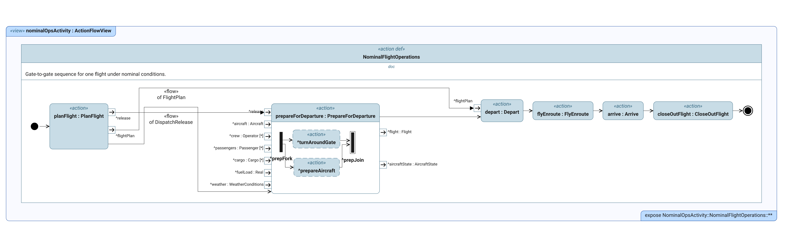

# Journal — 2026-10-06

## 20:10 — Welcome

**Recap:**
- Interim Report #2 is due 10-25, 19 days out. The last two sessions (10-04, 10-05) went to the §11 experiment; its central claim is still undecided and no model or report work was done in either.
- The traceability chain (ECD 10-12) is 6 days out and not started. Still slipped: the context diagram box (09-07), RACCI items and swimlanes (09-10), sequence diagrams (09-22), and the activity diagram (10-01).
- Blocked on the adviser: scope option (a/b/c) and the current-state metric. Still no record that the meeting happened. Working tree: new highlights in the Sheth et al. credits-concept PDF and a rebuilt `report/main.pdf`, both uncommitted.

**Focus picks (Professor):**
1. Write the one-page experiment definition, capped at one hour, central claim first. Yesterday's priority is still the right one: two sessions of reading have not settled what the experiment is for, and the page is also what the adviser needs to answer the scope question.
2. Finish the nominal-flight activity diagram with swimlanes and check the context diagram box. Carried over three times now, and it is the most direct source of a preliminary result for Report #2.
3. Start the traceability chain or re-date it deliberately. Its ECD is in 6 days, nothing exists, and MOE/MOP (10-17) and the requirements model (10-20) depend on it.

## 21:12 — Sign-Off

**What was worked on and why:** The session went to the nominal-flight activity diagram (focus pick 2) and to getting the model to render and parse cleanly in Syside. The owner did the model work by hand; Claude's only part was setting up a Python environment at the end. The one-page experiment definition (focus pick 1) and the traceability chain (focus pick 3) were not touched.

**What changed** (all in commit `0fbe6c6`, 21:11, except the last bullet):
- `cameo_models/nas_activity_diagram-nominal_ops.sysml`: added a `Prework` action (airline planning that happens before flight planning; not yet connected to the start node) and a `SupplyFuel` action. `PrepareForDeparture` now has real inputs (aircraft, crew, passengers, cargo, fuel load, actual weather) and outputs (`Flight`, `AircraftState`). The `prepareCrew` branch was removed from the fork. Still no swimlanes, and the sub-actions are still placeholders described in comments.
- `cameo_models/nas_sysml_package_definitions.sysml`: new `WeatherConditions` item for the actual weather, kept separate from the reports `WeatherService` produces. It is an outside input the system cannot change (consistent with D-007).
- `cameo_models/nas_package_my_views.sysml`: new `nominalOpsActivity` view so the activity diagram renders. First render saved as `report/figures/diagram-nominalOpsActivity.png`.
- `requirements_nas_system.sysml`, `requirements_stakeholders.sysml`, `scenarios/hub-to-hub-example.sysml`: attribute assignments changed from `x = value` to `:>> x = value` (redefinition) so Syside accepts them. No content change.
- New highlights in the Sheth et al. 2012 credits-concept PDF; `report/main.pdf` rebuilt. The commit message also mentions hand critiques of the Report #1 submittal; nothing about those is written down in the repo yet.
- Not committed: a Python virtual environment at `.venv/` in the repo root (already git-ignored) with `syside` 0.11.0 on Python 3.14.2, for scripting model runs. Only `import syside` was tested. The Python package needs its own licence key, separate from the VS Code extension, and that has not been checked.

Draft activity diagram as rendered today (first render, not final):

**To-do boxes:** none checked. The activity diagram box (§10) stays open: the diagram is partly built and has no swimlanes or scenario walkthrough.

**Blocked:** unchanged. Scope option (a/b/c) and the current-state metric still wait on the adviser, and there is still no record that the meeting happened.

**PM status check (2026-10-06):** Behind. Interim Report #2 is due 10-25, 19 days out.
- At risk: traceability chain, ECD 10-12 (6 days), 0 of 5 boxes, not started. MOE/MOP, ECD 10-17 (11 days), depends on it. Requirements model, ECD 10-20: two requirements files exist and now parse, but nothing traces to stakeholders yet, which is the milestone's metric.
- Slipped: context diagram (09-07), RACCI and authority transitions (09-10, 0 of 6), swimlanes (09-10), sequence diagrams (09-22), activity diagram (10-01, now in progress).
- Not on the ECD table but holding up §11: the one-page experiment definition, now carried over three sessions without being written.
- Recommended action: accept that the 10-12 traceability date will slip and re-date it next session against 10-25, in writing, with the downstream dates (10-17, 10-20) moved to match. Decide at the same time which slipped diagrams Report #2 actually needs and drop the rest from this month.

**Next steps:**
1. Write the one-page experiment definition, capped at one hour, central claim first. Unchanged from 10-05 and 10-06.
2. Finish the activity diagram: connect `Prework`, replace the placeholder sub-actions in `PrepareForDeparture`, add swimlanes, then walk the hub-to-hub scenario through it. Check the §10 box only after the walkthrough.
3. Re-date the traceability chain and its dependents against 10-25. Separately, load one `.sysml` file from Python in `.venv` to find out whether the Syside licence works before planning any automation around it.

## 21:25 — Experiment one-pager drafted (after sign-off)

At the owner's request, Claude drafted the one-page experiment definition from the 10-04 and 10-05 discussions: [experiment-definition.md](../../../knowledge/models/experiment-definition.md). It is a draft with nothing decided. Four items are marked for the owner to decide (central claim, which aircraft descends, what happens after the descent, the truth model), and the hand check on context-diagram decisions is left for the owner. It includes a rough effect-size estimate that still needs verifying. Next step 1 above changes from "write the page" to "review it and make the four decisions."
